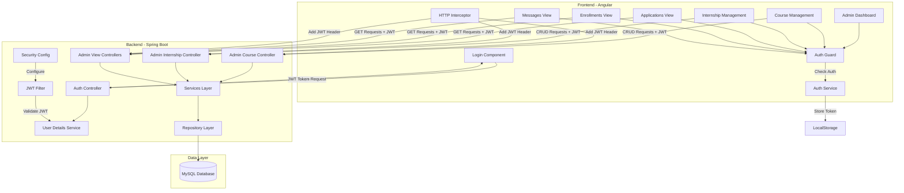
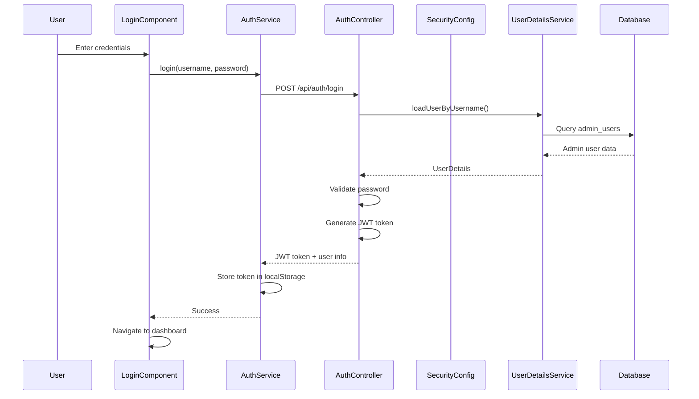
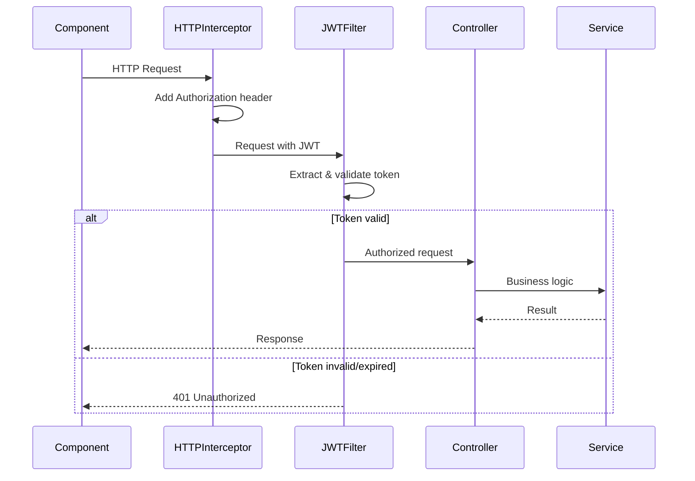

# Design Document: Admin Panel

## Overview

The Admin Panel is a secure web-based management interface that enables administrators to manage the WebVibes Technology website content. The system consists of two main parts:

1. **Backend Security Layer**: Spring Security with JWT-based authentication protecting admin endpoints
2. **Frontend Admin Interface**: Angular-based admin dashboard with protected routes and management views

The design integrates seamlessly with the existing Spring Boot backend and Angular frontend, adding authentication, authorization, and CRUD operations for courses and internships. The system replaces hardcoded frontend data with database-driven content, making the public website dynamic.

Key design principles:
- Stateless authentication using JWT tokens
- Role-based access control (RBAC) with ADMIN role
- RESTful API design for admin operations
- Separation of public and admin endpoints
- Client-side route protection with Angular guards
- Comprehensive validation at both frontend and backend layers

## Architecture

### System Components



### Authentication Flow



### Request Authorization Flow



## Components and Interfaces

### Backend Components

#### 1. Security Configuration

**SecurityConfig**
- Configures Spring Security with JWT authentication
- Defines public and protected endpoints
- Disables CSRF for stateless API
- Configures password encoder (BCrypt)

```java
@Configuration
@EnableWebSecurity
public class SecurityConfig {
    
    @Bean
    public SecurityFilterChain filterChain(HttpSecurity http);
    
    @Bean
    public PasswordEncoder passwordEncoder();
    
    @Bean
    public AuthenticationManager authenticationManager(AuthenticationConfiguration config);
}
```

**JwtAuthenticationFilter**
- Intercepts all requests
- Extracts JWT from Authorization header
- Validates token and sets authentication context

```java
public class JwtAuthenticationFilter extends OncePerRequestFilter {
    
    protected void doFilterInternal(
        HttpServletRequest request,
        HttpServletResponse response,
        FilterChain filterChain
    );
    
    private String extractTokenFromRequest(HttpServletRequest request);
}
```

**JwtTokenProvider**
- Generates JWT tokens
- Validates tokens
- Extracts claims from tokens

```java
@Component
public class JwtTokenProvider {
    
    public String generateToken(Authentication authentication);
    
    public boolean validateToken(String token);
    
    public String getUsernameFromToken(String token);
    
    public Claims getClaimsFromToken(String token);
}
```

**CustomUserDetailsService**
- Loads user details from database
- Implements Spring Security UserDetailsService

```java
@Service
public class CustomUserDetailsService implements UserDetailsService {
    
    @Override
    public UserDetails loadUserByUsername(String username);
}
```

#### 2. Authentication Controller

**AuthController**
- Handles login requests
- Returns JWT token on successful authentication

```java
@RestController
@RequestMapping("/api/auth")
public class AuthController {
    
    @PostMapping("/login")
    public ResponseEntity<JwtAuthResponse> login(@RequestBody LoginRequest request);
    
    @PostMapping("/logout")
    public ResponseEntity<MessageResponse> logout();
}
```

#### 3. Admin Controllers

**AdminCourseController**
- CRUD operations for courses
- Protected with @PreAuthorize("hasRole('ADMIN')")

```java
@RestController
@RequestMapping("/api/admin/courses")
@PreAuthorize("hasRole('ADMIN')")
public class AdminCourseController {
    
    @PostMapping
    public ResponseEntity<CourseDTO> createCourse(@Valid @RequestBody CourseDTO courseDTO);
    
    @PutMapping("/{id}")
    public ResponseEntity<CourseDTO> updateCourse(
        @PathVariable Long id,
        @Valid @RequestBody CourseDTO courseDTO
    );
    
    @DeleteMapping("/{id}")
    public ResponseEntity<MessageResponse> deleteCourse(@PathVariable Long id);
    
    @GetMapping
    public ResponseEntity<List<CourseDTO>> getAllCourses();
    
    @GetMapping("/{id}")
    public ResponseEntity<CourseDTO> getCourseById(@PathVariable Long id);
}
```

**AdminInternshipController**
- CRUD operations for internships
- Protected with @PreAuthorize("hasRole('ADMIN')")

```java
@RestController
@RequestMapping("/api/admin/internships")
@PreAuthorize("hasRole('ADMIN')")
public class AdminInternshipController {
    
    @PostMapping
    public ResponseEntity<InternshipDTO> createInternship(@Valid @RequestBody InternshipDTO internshipDTO);
    
    @PutMapping("/{id}")
    public ResponseEntity<InternshipDTO> updateInternship(
        @PathVariable Long id,
        @Valid @RequestBody InternshipDTO internshipDTO
    );
    
    @DeleteMapping("/{id}")
    public ResponseEntity<MessageResponse> deleteInternship(@PathVariable Long id);
    
    @GetMapping
    public ResponseEntity<List<InternshipDTO>> getAllInternships();
    
    @GetMapping("/{id}")
    public ResponseEntity<InternshipDTO> getInternshipById(@PathVariable Long id);
}
```

**AdminViewController**
- Read-only endpoints for viewing applications, enrollments, and messages
- Protected with @PreAuthorize("hasRole('ADMIN')")

```java
@RestController
@RequestMapping("/api/admin")
@PreAuthorize("hasRole('ADMIN')")
public class AdminViewController {
    
    @GetMapping("/applications")
    public ResponseEntity<List<InternshipApplicationDTO>> getAllApplications();
    
    @GetMapping("/enrollments")
    public ResponseEntity<List<CourseEnrollmentDTO>> getAllEnrollments();
    
    @GetMapping("/messages")
    public ResponseEntity<List<ContactMessageDTO>> getAllMessages();
}
```

#### 4. Service Layer

**AdminUserService**
- Manages admin user operations
- Handles password hashing

```java
@Service
public class AdminUserService {
    
    public AdminUser findByUsername(String username);
    
    public AdminUser createAdminUser(String username, String password);
    
    public boolean validatePassword(String rawPassword, String encodedPassword);
}
```

**CourseService** (Enhanced)
- Add CRUD operations for admin
- Existing read operations remain for public access

```java
@Service
public class CourseService {
    
    // New admin operations
    public CourseDTO createCourse(CourseDTO courseDTO);
    
    public CourseDTO updateCourse(Long id, CourseDTO courseDTO);
    
    public void deleteCourse(Long id);
    
    public CourseDTO getCourseById(Long id);
    
    // Existing public operations
    public List<CourseDTO> getAllCourses();
}
```

**InternshipService** (Enhanced)
- Add CRUD operations for admin
- Existing read operations remain for public access

```java
@Service
public class InternshipService {
    
    // New admin operations
    public InternshipDTO createInternship(InternshipDTO internshipDTO);
    
    public InternshipDTO updateInternship(Long id, InternshipDTO internshipDTO);
    
    public void deleteInternship(Long id);
    
    public InternshipDTO getInternshipById(Long id);
    
    // Existing public operations
    public List<InternshipDTO> getAllInternships();
}
```

#### 5. Repository Layer

**AdminUserRepository**
- JPA repository for admin users

```java
@Repository
public interface AdminUserRepository extends JpaRepository<AdminUser, Long> {
    
    Optional<AdminUser> findByUsername(String username);
    
    boolean existsByUsername(String username);
}
```

**CourseRepository** (New)
- JPA repository for courses

```java
@Repository
public interface CourseRepository extends JpaRepository<Course, Long> {
    
    List<Course> findAllByOrderByCreatedAtDesc();
}
```

**InternshipRepository** (New)
- JPA repository for internships

```java
@Repository
public interface InternshipRepository extends JpaRepository<Internship, Long> {
    
    List<Internship> findAllByOrderByCreatedAtDesc();
}
```

### Frontend Components

#### 1. Authentication Components

**LoginComponent**
- Login form with username and password fields
- Calls AuthService for authentication
- Redirects to dashboard on success
- Displays error messages on failure

```typescript
@Component({
  selector: 'app-login',
  templateUrl: './login.component.html',
  styleUrls: ['./login.component.css']
})
export class LoginComponent {
  loginForm: FormGroup;
  errorMessage: string = '';
  
  constructor(
    private authService: AuthService,
    private router: Router,
    private formBuilder: FormBuilder
  ) {}
  
  onSubmit(): void;
  
  private handleLoginSuccess(response: JwtAuthResponse): void;
  
  private handleLoginError(error: any): void;
}
```

#### 2. Admin Dashboard Components

**AdminDashboardComponent**
- Main dashboard with navigation
- Displays summary statistics
- Links to management sections

```typescript
@Component({
  selector: 'app-admin-dashboard',
  templateUrl: './admin-dashboard.component.html',
  styleUrls: ['./admin-dashboard.component.css']
})
export class AdminDashboardComponent implements OnInit {
  stats: DashboardStats;
  
  constructor(private adminService: AdminService) {}
  
  ngOnInit(): void;
  
  logout(): void;
}
```

**CourseManagementComponent**
- Lists all courses in a table
- Create, edit, delete operations
- Form for adding/editing courses

```typescript
@Component({
  selector: 'app-course-management',
  templateUrl: './course-management.component.html',
  styleUrls: ['./course-management.component.css']
})
export class CourseManagementComponent implements OnInit {
  courses: CourseDTO[] = [];
  selectedCourse: CourseDTO | null = null;
  courseForm: FormGroup;
  isEditMode: boolean = false;
  
  constructor(
    private courseService: CourseService,
    private formBuilder: FormBuilder
  ) {}
  
  ngOnInit(): void;
  
  loadCourses(): void;
  
  onCreateCourse(): void;
  
  onEditCourse(course: CourseDTO): void;
  
  onSaveCourse(): void;
  
  onDeleteCourse(id: number): void;
  
  onCancelEdit(): void;
}
```

**InternshipManagementComponent**
- Lists all internships in a table
- Create, edit, delete operations
- Form for adding/editing internships

```typescript
@Component({
  selector: 'app-internship-management',
  templateUrl: './internship-management.component.html',
  styleUrls: ['./internship-management.component.css']
})
export class InternshipManagementComponent implements OnInit {
  internships: InternshipDTO[] = [];
  selectedInternship: InternshipDTO | null = null;
  internshipForm: FormGroup;
  isEditMode: boolean = false;
  
  constructor(
    private internshipService: InternshipService,
    private formBuilder: FormBuilder
  ) {}
  
  ngOnInit(): void;
  
  loadInternships(): void;
  
  onCreateInternship(): void;
  
  onEditInternship(internship: InternshipDTO): void;
  
  onSaveInternship(): void;
  
  onDeleteInternship(id: number): void;
  
  onCancelEdit(): void;
}
```

**ApplicationsViewComponent**
- Displays all internship applications
- Read-only table view
- Sorted by submission date

```typescript
@Component({
  selector: 'app-applications-view',
  templateUrl: './applications-view.component.html',
  styleUrls: ['./applications-view.component.css']
})
export class ApplicationsViewComponent implements OnInit {
  applications: InternshipApplicationDTO[] = [];
  
  constructor(private adminService: AdminService) {}
  
  ngOnInit(): void;
  
  loadApplications(): void;
}
```

**EnrollmentsViewComponent**
- Displays all course enrollments
- Read-only table view
- Sorted by enrollment date

```typescript
@Component({
  selector: 'app-enrollments-view',
  templateUrl: './enrollments-view.component.html',
  styleUrls: ['./enrollments-view.component.css']
})
export class EnrollmentsViewComponent implements OnInit {
  enrollments: CourseEnrollmentDTO[] = [];
  
  constructor(private adminService: AdminService) {}
  
  ngOnInit(): void;
  
  loadEnrollments(): void;
}
```

**MessagesViewComponent**
- Displays all contact messages
- Read-only table view
- Sorted by submission date

```typescript
@Component({
  selector: 'app-messages-view',
  templateUrl: './messages-view.component.html',
  styleUrls: ['./messages-view.component.css']
})
export class MessagesViewComponent implements OnInit {
  messages: ContactMessageDTO[] = [];
  
  constructor(private adminService: AdminService) {}
  
  ngOnInit(): void;
  
  loadMessages(): void;
}
```

#### 3. Services

**AuthService**
- Handles authentication operations
- Manages JWT token storage
- Provides authentication state

```typescript
@Injectable({
  providedIn: 'root'
})
export class AuthService {
  private readonly TOKEN_KEY = 'jwt_token';
  private readonly USER_KEY = 'current_user';
  private currentUserSubject: BehaviorSubject<AdminUser | null>;
  public currentUser: Observable<AdminUser | null>;
  
  constructor(private http: HttpClient) {}
  
  login(username: string, password: string): Observable<JwtAuthResponse>;
  
  logout(): void;
  
  getToken(): string | null;
  
  isAuthenticated(): boolean;
  
  getCurrentUser(): AdminUser | null;
  
  private setToken(token: string): void;
  
  private setUser(user: AdminUser): void;
  
  private clearStorage(): void;
}
```

**AdminService**
- Handles admin-specific API calls
- CRUD operations for courses and internships
- Fetches applications, enrollments, and messages

```typescript
@Injectable({
  providedIn: 'root'
})
export class AdminService {
  private apiUrl = environment.apiUrl + '/api/admin';
  
  constructor(private http: HttpClient) {}
  
  // Course operations
  createCourse(course: CourseDTO): Observable<CourseDTO>;
  
  updateCourse(id: number, course: CourseDTO): Observable<CourseDTO>;
  
  deleteCourse(id: number): Observable<MessageResponse>;
  
  getCourses(): Observable<CourseDTO[]>;
  
  // Internship operations
  createInternship(internship: InternshipDTO): Observable<InternshipDTO>;
  
  updateInternship(id: number, internship: InternshipDTO): Observable<InternshipDTO>;
  
  deleteInternship(id: number): Observable<MessageResponse>;
  
  getInternships(): Observable<InternshipDTO[]>;
  
  // View operations
  getApplications(): Observable<InternshipApplicationDTO[]>;
  
  getEnrollments(): Observable<CourseEnrollmentDTO[]>;
  
  getMessages(): Observable<ContactMessageDTO[]>;
}
```

#### 4. Guards and Interceptors

**AuthGuard**
- Protects admin routes
- Redirects to login if not authenticated

```typescript
@Injectable({
  providedIn: 'root'
})
export class AuthGuard implements CanActivate {
  
  constructor(
    private authService: AuthService,
    private router: Router
  ) {}
  
  canActivate(
    route: ActivatedRouteSnapshot,
    state: RouterStateSnapshot
  ): boolean;
}
```

**JwtInterceptor**
- Adds JWT token to all outgoing requests
- Handles token expiration

```typescript
@Injectable()
export class JwtInterceptor implements HttpInterceptor {
  
  constructor(private authService: AuthService) {}
  
  intercept(
    request: HttpRequest<any>,
    next: HttpHandler
  ): Observable<HttpEvent<any>>;
}
```

**ErrorInterceptor** (Enhanced)
- Handles HTTP errors
- Redirects to login on 401
- Displays user-friendly error messages

```typescript
@Injectable()
export class ErrorInterceptor implements HttpInterceptor {
  
  constructor(
    private authService: AuthService,
    private router: Router
  ) {}
  
  intercept(
    request: HttpRequest<any>,
    next: HttpHandler
  ): Observable<HttpEvent<any>>;
}
```

#### 5. Routing Configuration

**Admin Routes**
- All admin routes protected by AuthGuard
- Lazy loading for admin module (optional optimization)

```typescript
const routes: Routes = [
  { path: 'login', component: LoginComponent },
  {
    path: 'admin',
    canActivate: [AuthGuard],
    children: [
      { path: '', redirectTo: 'dashboard', pathMatch: 'full' },
      { path: 'dashboard', component: AdminDashboardComponent },
      { path: 'courses', component: CourseManagementComponent },
      { path: 'internships', component: InternshipManagementComponent },
      { path: 'applications', component: ApplicationsViewComponent },
      { path: 'enrollments', component: EnrollmentsViewComponent },
      { path: 'messages', component: MessagesViewComponent }
    ]
  }
];
```

## Data Models

### Backend Entities

#### AdminUser Entity

```java
@Entity
@Table(name = "admin_users", indexes = {
    @Index(name = "idx_username", columnList = "username", unique = true)
})
public class AdminUser {
    
    @Id
    @GeneratedValue(strategy = GenerationType.IDENTITY)
    private Long id;
    
    @Column(nullable = false, unique = true, length = 50)
    private String username;
    
    @Column(nullable = false)
    private String password; // BCrypt hashed
    
    @Column(nullable = false, length = 20)
    private String role; // "ROLE_ADMIN"
    
    @Column(name = "created_at", nullable = false, updatable = false)
    private LocalDateTime createdAt;
    
    @Column(name = "last_login")
    private LocalDateTime lastLogin;
    
    // Getters and setters
}
```

#### Course Entity

```java
@Entity
@Table(name = "courses", indexes = {
    @Index(name = "idx_created_at", columnList = "created_at")
})
public class Course {
    
    @Id
    @GeneratedValue(strategy = GenerationType.IDENTITY)
    private Long id;
    
    @Column(nullable = false, length = 100)
    private String name;
    
    @Column(columnDefinition = "TEXT", nullable = false)
    private String description;
    
    @Column(nullable = false)
    private Integer duration; // in weeks
    
    @Column(columnDefinition = "TEXT")
    private String technologies; // Comma-separated or JSON
    
    @Column(name = "created_at", nullable = false, updatable = false)
    private LocalDateTime createdAt;
    
    @Column(name = "updated_at")
    private LocalDateTime updatedAt;
    
    // Getters and setters
}
```

#### Internship Entity

```java
@Entity
@Table(name = "internships", indexes = {
    @Index(name = "idx_created_at", columnList = "created_at")
})
public class Internship {
    
    @Id
    @GeneratedValue(strategy = GenerationType.IDENTITY)
    private Long id;
    
    @Column(nullable = false, length = 100)
    private String type;
    
    @Column(columnDefinition = "TEXT", nullable = false)
    private String description;
    
    @Column(nullable = false)
    private Integer duration; // in months
    
    @Column(columnDefinition = "TEXT")
    private String skills; // Comma-separated or JSON
    
    @Column(name = "created_at", nullable = false, updatable = false)
    private LocalDateTime createdAt;
    
    @Column(name = "updated_at")
    private LocalDateTime updatedAt;
    
    // Getters and setters
}
```

### Backend DTOs

#### LoginRequest

```java
public class LoginRequest {
    
    @NotBlank(message = "Username is required")
    private String username;
    
    @NotBlank(message = "Password is required")
    private String password;
    
    // Getters and setters
}
```

#### JwtAuthResponse

```java
public class JwtAuthResponse {
    
    private String token;
    private String type = "Bearer";
    private String username;
    private String role;
    
    // Constructors, getters and setters
}
```

#### CourseDTO

```java
public class CourseDTO {
    
    private Long id;
    
    @NotBlank(message = "Course name is required")
    @Size(max = 100, message = "Course name must not exceed 100 characters")
    private String name;
    
    @NotBlank(message = "Description is required")
    private String description;
    
    @NotNull(message = "Duration is required")
    @Min(value = 1, message = "Duration must be at least 1 week")
    private Integer duration;
    
    private String technologies;
    
    private LocalDateTime createdAt;
    private LocalDateTime updatedAt;
    
    // Getters and setters
}
```

#### InternshipDTO

```java
public class InternshipDTO {
    
    private Long id;
    
    @NotBlank(message = "Internship type is required")
    @Size(max = 100, message = "Type must not exceed 100 characters")
    private String type;
    
    @NotBlank(message = "Description is required")
    private String description;
    
    @NotNull(message = "Duration is required")
    @Min(value = 1, message = "Duration must be at least 1 month")
    private Integer duration;
    
    private String skills;
    
    private LocalDateTime createdAt;
    private LocalDateTime updatedAt;
    
    // Getters and setters
}
```

### Frontend Models

#### AdminUser

```typescript
export interface AdminUser {
  username: string;
  role: string;
}
```

#### JwtAuthResponse

```typescript
export interface JwtAuthResponse {
  token: string;
  type: string;
  username: string;
  role: string;
}
```

#### LoginRequest

```typescript
export interface LoginRequest {
  username: string;
  password: string;
}
```

#### CourseDTO

```typescript
export interface CourseDTO {
  id?: number;
  name: string;
  description: string;
  duration: number;
  technologies?: string;
  createdAt?: Date;
  updatedAt?: Date;
}
```

#### InternshipDTO

```typescript
export interface InternshipDTO {
  id?: number;
  type: string;
  description: string;
  duration: number;
  skills?: string;
  createdAt?: Date;
  updatedAt?: Date;
}
```

### Database Schema

#### admin_users Table

```sql
CREATE TABLE admin_users (
    id BIGINT AUTO_INCREMENT PRIMARY KEY,
    username VARCHAR(50) NOT NULL UNIQUE,
    password VARCHAR(255) NOT NULL,
    role VARCHAR(20) NOT NULL DEFAULT 'ROLE_ADMIN',
    created_at TIMESTAMP NOT NULL DEFAULT CURRENT_TIMESTAMP,
    last_login TIMESTAMP NULL,
    INDEX idx_username (username)
);
```

#### courses Table

```sql
CREATE TABLE courses (
    id BIGINT AUTO_INCREMENT PRIMARY KEY,
    name VARCHAR(100) NOT NULL,
    description TEXT NOT NULL,
    duration INT NOT NULL,
    technologies TEXT,
    created_at TIMESTAMP NOT NULL DEFAULT CURRENT_TIMESTAMP,
    updated_at TIMESTAMP NULL ON UPDATE CURRENT_TIMESTAMP,
    INDEX idx_created_at (created_at)
);
```

#### internships Table

```sql
CREATE TABLE internships (
    id BIGINT AUTO_INCREMENT PRIMARY KEY,
    type VARCHAR(100) NOT NULL,
    description TEXT NOT NULL,
    duration INT NOT NULL,
    skills TEXT,
    created_at TIMESTAMP NOT NULL DEFAULT CURRENT_TIMESTAMP,
    updated_at TIMESTAMP NULL ON UPDATE CURRENT_TIMESTAMP,
    INDEX idx_created_at (created_at)
);
```

### API Endpoints

#### Authentication Endpoints

| Method | Endpoint | Description | Auth Required |
|--------|----------|-------------|---------------|
| POST | /api/auth/login | Authenticate admin user | No |
| POST | /api/auth/logout | Logout admin user | Yes |

#### Admin Course Endpoints

| Method | Endpoint | Description | Auth Required |
|--------|----------|-------------|---------------|
| GET | /api/admin/courses | Get all courses | Yes (ADMIN) |
| GET | /api/admin/courses/{id} | Get course by ID | Yes (ADMIN) |
| POST | /api/admin/courses | Create new course | Yes (ADMIN) |
| PUT | /api/admin/courses/{id} | Update course | Yes (ADMIN) |
| DELETE | /api/admin/courses/{id} | Delete course | Yes (ADMIN) |

#### Admin Internship Endpoints

| Method | Endpoint | Description | Auth Required |
|--------|----------|-------------|---------------|
| GET | /api/admin/internships | Get all internships | Yes (ADMIN) |
| GET | /api/admin/internships/{id} | Get internship by ID | Yes (ADMIN) |
| POST | /api/admin/internships | Create new internship | Yes (ADMIN) |
| PUT | /api/admin/internships/{id} | Update internship | Yes (ADMIN) |
| DELETE | /api/admin/internships/{id} | Delete internship | Yes (ADMIN) |

#### Admin View Endpoints

| Method | Endpoint | Description | Auth Required |
|--------|----------|-------------|---------------|
| GET | /api/admin/applications | Get all internship applications | Yes (ADMIN) |
| GET | /api/admin/enrollments | Get all course enrollments | Yes (ADMIN) |
| GET | /api/admin/messages | Get all contact messages | Yes (ADMIN) |

#### Public Endpoints (Existing - Enhanced)

| Method | Endpoint | Description | Auth Required |
|--------|----------|-------------|---------------|
| GET | /api/courses | Get all courses (public) | No |
| GET | /api/internships | Get all internships (public) | No |


## Correctness Properties

*A property is a characteristic or behavior that should hold true across all valid executions of a system—essentially, a formal statement about what the system should do. Properties serve as the bridge between human-readable specifications and machine-verifiable correctness guarantees.*

### Property 1: Valid authentication generates JWT token

*For any* valid admin user with correct credentials, authenticating should return a valid JWT token that can be used to access admin endpoints.

**Validates: Requirements 1.1**

### Property 2: Invalid credentials are rejected

*For any* invalid credential combination (wrong username, wrong password, or both), the authentication attempt should be rejected with an appropriate error message.

**Validates: Requirements 1.2**

### Property 3: Expired tokens are rejected

*For any* expired JWT token, requests to admin endpoints should be rejected and require re-authentication.

**Validates: Requirements 1.3**

### Property 4: Passwords are hashed before storage

*For any* admin user created in the system, the stored password should be hashed using BCrypt and should not match the plaintext password.

**Validates: Requirements 1.4**

### Property 5: Logout clears client-side session

*For any* authenticated admin session, logging out should remove the JWT token from client-side storage.

**Validates: Requirements 1.5**

### Property 6: Unauthenticated requests are rejected

*For any* request to admin endpoints without a valid JWT token (missing, malformed, or invalid), the system should return a 401 Unauthorized response.

**Validates: Requirements 2.1, 2.4**

### Property 7: Non-admin roles are forbidden

*For any* JWT token with a role other than ADMIN, requests to admin endpoints should return a 403 Forbidden response.

**Validates: Requirements 2.2**

### Property 8: Route guard prevents unauthorized navigation

*For any* attempt to navigate to admin routes without authentication, the route guard should redirect to the login page.

**Validates: Requirements 2.3**

### Property 9: Token validation is consistent

*For any* admin endpoint, all requests should require a valid JWT token to be processed.

**Validates: Requirements 2.5**

### Property 10: Course CRUD operations persist correctly

*For any* valid course data:
- Creating a course should persist it with a unique ID
- Updating a course should modify the existing record
- Deleting a course should remove it from the database
- Fetching all courses should return all persisted courses

**Validates: Requirements 3.1, 3.2, 3.3, 3.4**

### Property 11: Course validation rejects invalid input

*For any* course with a whitespace-only name or non-positive duration, the create or update operation should be rejected with a validation error.

**Validates: Requirements 3.5, 3.6**

### Property 12: Internship CRUD operations persist correctly

*For any* valid internship data:
- Creating an internship should persist it with a unique ID
- Updating an internship should modify the existing record
- Deleting an internship should remove it from the database
- Fetching all internships should return all persisted internships

**Validates: Requirements 4.1, 4.2, 4.3, 4.4**

### Property 13: Internship validation rejects invalid input

*For any* internship with a whitespace-only type or non-positive duration, the create or update operation should be rejected with a validation error.

**Validates: Requirements 4.5, 4.6**

### Property 14: Applications retrieval returns complete data

*For any* set of internship applications in the database, fetching all applications should return all records with student name, email, phone, internship type, and application date fields present.

**Validates: Requirements 5.1, 5.2**

### Property 15: Applications are sorted by date descending

*For any* set of internship applications with different submission dates, fetching all applications should return them sorted by submission date in descending order (newest first).

**Validates: Requirements 5.3**

### Property 16: Enrollments retrieval returns complete data

*For any* set of course enrollments in the database, fetching all enrollments should return all records with student name, email, phone, course name, and enrollment date fields present.

**Validates: Requirements 6.1, 6.2**

### Property 17: Enrollments are sorted by date descending

*For any* set of course enrollments with different submission dates, fetching all enrollments should return them sorted by enrollment date in descending order (newest first).

**Validates: Requirements 6.3**

### Property 18: Messages retrieval returns complete data

*For any* set of contact messages in the database, fetching all messages should return all records with sender name, email, subject, message content, and submission date fields present.

**Validates: Requirements 7.1, 7.2**

### Property 19: Messages are sorted by date descending

*For any* set of contact messages with different submission dates, fetching all messages should return them sorted by submission date in descending order (newest first).

**Validates: Requirements 7.3**

### Property 20: Public API reflects admin changes to courses

*For any* course created via admin API, the public courses endpoint should immediately return the new course. For any course deleted via admin API, the public courses endpoint should no longer return the deleted course.

**Validates: Requirements 8.1, 8.3, 8.4**

### Property 21: Public API reflects admin changes to internships

*For any* internship created via admin API, the public internships endpoint should immediately return the new internship. For any internship deleted via admin API, the public internships endpoint should no longer return the deleted internship.

**Validates: Requirements 8.2, 8.5, 8.6**

### Property 22: Validation errors include field-specific details

*For any* request with validation errors, the error response should include detailed messages indicating which specific fields are invalid.

**Validates: Requirements 10.2**

## Error Handling

### Backend Error Handling

**Authentication Errors**
- Invalid credentials: Return 401 with message "Invalid username or password"
- Expired token: Return 401 with message "Token has expired"
- Missing token: Return 401 with message "Authentication required"
- Invalid token format: Return 401 with message "Invalid token format"

**Authorization Errors**
- Insufficient permissions: Return 403 with message "Access denied"
- Invalid role: Return 403 with message "Admin role required"

**Validation Errors**
- Return 400 Bad Request with detailed field-level error messages
- Include field name and specific validation failure reason
- Example: `{"name": "Course name is required", "duration": "Duration must be at least 1 week"}`

**Resource Not Found**
- Return 404 with message indicating which resource was not found
- Example: "Course with ID 123 not found"

**Database Errors**
- Log full error details server-side
- Return 500 with generic message "An error occurred while processing your request"
- Never expose internal database details to clients

**Constraint Violations**
- Duplicate username: Return 409 with message "Username already exists"
- Foreign key violations: Return 400 with appropriate message

### Frontend Error Handling

**HTTP Error Interceptor**
- 401 errors: Clear local storage and redirect to login page
- 403 errors: Display "Access denied" message
- 400 errors: Display validation errors next to form fields
- 404 errors: Display "Resource not found" message
- 500 errors: Display "Server error, please try again later"
- Network errors: Display "Network error, please check your connection"

**Form Validation**
- Validate all inputs before submission
- Display inline error messages for invalid fields
- Disable submit button until form is valid
- Show loading indicator during submission

**Token Expiration**
- Detect expired tokens from 401 responses
- Clear authentication state
- Redirect to login page
- Display message "Your session has expired, please log in again"

**Optimistic UI Updates**
- Show loading state during operations
- On success: Update UI and show success message
- On failure: Revert UI changes and show error message
- Provide retry option for failed operations

## Testing Strategy

### Dual Testing Approach

The testing strategy employs both unit tests and property-based tests to ensure comprehensive coverage:

**Unit Tests**: Focus on specific examples, edge cases, and integration points
- Authentication flow with specific credentials
- Token generation and validation with known inputs
- CRUD operations with specific test data
- Error handling for specific failure scenarios
- Component integration tests

**Property-Based Tests**: Verify universal properties across all inputs
- Authentication with randomly generated valid/invalid credentials
- Token validation with randomly generated tokens
- CRUD operations with randomly generated entities
- Validation with randomly generated invalid inputs
- Sorting and filtering with randomly generated datasets

### Backend Testing

**Property-Based Testing Library**: Use JUnit 5 with jqwik for property-based testing in Java

**Test Configuration**:
- Minimum 100 iterations per property test
- Each test tagged with feature name and property number
- Tag format: `@Tag("Feature: admin-panel, Property N: [property text]")`

**Test Categories**:

1. **Authentication Properties** (Properties 1-5)
   - Generate random admin users with valid/invalid credentials
   - Test token generation, validation, and expiration
   - Test password hashing with various inputs
   - Test logout behavior

2. **Authorization Properties** (Properties 6-9)
   - Generate requests with various token states (missing, invalid, expired, valid)
   - Generate tokens with different roles
   - Test all admin endpoints for consistent authorization

3. **Course Management Properties** (Properties 10-11)
   - Generate random valid courses with various field values
   - Generate invalid courses (whitespace names, negative durations)
   - Test full CRUD lifecycle
   - Test validation error responses

4. **Internship Management Properties** (Properties 12-13)
   - Generate random valid internships with various field values
   - Generate invalid internships (whitespace types, negative durations)
   - Test full CRUD lifecycle
   - Test validation error responses

5. **View Operations Properties** (Properties 14-19)
   - Generate random sets of applications, enrollments, and messages
   - Test retrieval completeness
   - Test sorting with various date combinations

6. **Public API Integration Properties** (Properties 20-21)
   - Test that admin changes immediately reflect in public API
   - Test create-then-fetch and delete-then-fetch patterns

7. **Error Handling Properties** (Property 22)
   - Generate various invalid inputs
   - Verify error responses contain field-specific details

**Unit Tests**:
- Specific authentication scenarios (first login, repeated login, logout)
- Token expiration edge cases (just expired, far expired)
- Specific validation scenarios (empty string, null, special characters)
- Database constraint violations (duplicate username)
- Integration tests for controller-service-repository layers

### Frontend Testing

**Property-Based Testing Library**: Use fast-check for property-based testing in TypeScript

**Test Configuration**:
- Minimum 100 iterations per property test
- Each test tagged with feature name and property number
- Tag format: `// Feature: admin-panel, Property N: [property text]`

**Test Categories**:

1. **Authentication Service Tests**
   - Test token storage and retrieval
   - Test authentication state management
   - Test logout behavior

2. **Auth Guard Tests**
   - Test route protection with various authentication states
   - Test redirection behavior

3. **HTTP Interceptor Tests**
   - Test JWT header injection
   - Test error handling for various HTTP status codes

4. **Component Tests**
   - Test form validation with various inputs
   - Test CRUD operations with mock services
   - Test error display

**Unit Tests**:
- Specific user interactions (button clicks, form submissions)
- Component lifecycle hooks
- Service method calls with specific data
- Error handling for specific scenarios
- Integration tests with TestBed

### Integration Testing

**End-to-End Scenarios**:
- Complete authentication flow (login → access admin → logout)
- Complete course management flow (create → update → delete)
- Complete internship management flow (create → update → delete)
- Public website integration (admin creates course → public sees course)
- Token expiration handling (login → wait for expiration → access denied → re-login)

**Database Integration**:
- Test with actual MySQL database (test container or test database)
- Verify data persistence across operations
- Test transaction rollback on errors
- Test concurrent operations

### Security Testing

**Authentication Security**:
- Test password hashing strength
- Test token signature validation
- Test token expiration enforcement
- Test brute force protection (rate limiting)

**Authorization Security**:
- Test endpoint protection for all admin routes
- Test role-based access control
- Test token tampering detection
- Test privilege escalation attempts

**Input Validation Security**:
- Test SQL injection prevention
- Test XSS prevention
- Test input sanitization
- Test maximum length enforcement

### Performance Testing

**Load Testing**:
- Test authentication under concurrent requests
- Test CRUD operations under load
- Test public API performance with large datasets

**Response Time Testing**:
- Authentication should complete within 500ms
- CRUD operations should complete within 200ms
- List operations should complete within 300ms

### Test Data Management

**Test Data Generation**:
- Use property-based testing libraries to generate random valid data
- Use builders/factories for creating test entities
- Use faker libraries for realistic test data

**Test Database**:
- Use separate test database
- Reset database state between tests
- Use transactions for test isolation
- Seed initial data for integration tests

### Continuous Integration

**CI Pipeline**:
- Run all unit tests on every commit
- Run property-based tests on every commit
- Run integration tests on pull requests
- Run security tests on pull requests
- Enforce minimum code coverage (80%)

**Test Reporting**:
- Generate test coverage reports
- Report property test failures with counterexamples
- Track test execution time
- Alert on test failures
