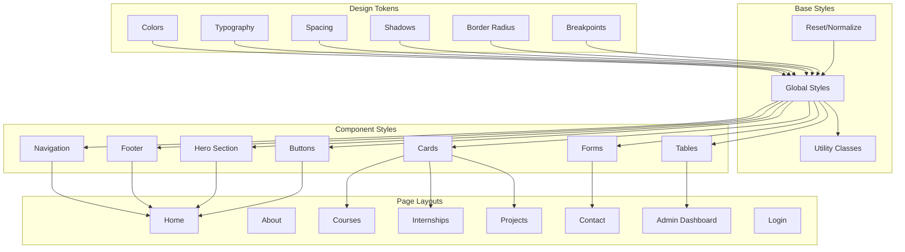
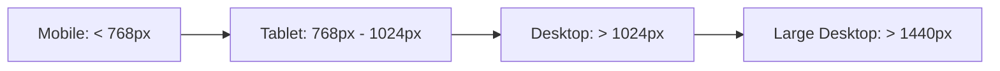

# Design Document: Modern Startup UI

## Overview

The Modern Startup UI feature transforms the WebVibes Technology website into a contemporary, visually appealing platform that reflects modern design principles. This design focuses on creating a clean, professional, and engaging user experience through thoughtful use of color, typography, spacing, animations, and responsive layouts.

The design system is built on Angular components with SCSS styling, leveraging CSS Grid, Flexbox, and modern CSS features. The approach emphasizes mobile-first responsive design, accessibility, and performance optimization while maintaining consistency across all pages.

Key design principles:
- Mobile-first responsive design with fluid layouts
- Clean, minimalist aesthetic with purposeful whitespace
- Smooth animations and micro-interactions for engagement
- Accessible design meeting WCAG 2.1 AA standards
- Performance-optimized with lazy loading and efficient rendering
- Consistent design language across all components

## Architecture

### Design System Structure



### Responsive Breakpoint System



## Design Tokens

### Color Palette


**Primary Colors**
```scss
$primary-900: #1a237e;  // Deep blue
$primary-700: #283593;  // Dark blue
$primary-500: #3f51b5;  // Main brand blue
$primary-300: #7986cb;  // Light blue
$primary-100: #c5cae9;  // Very light blue
```

**Secondary Colors**
```scss
$secondary-900: #004d40;  // Deep teal
$secondary-700: #00695c;  // Dark teal
$secondary-500: #009688;  // Main teal
$secondary-300: #4db6ac;  // Light teal
$secondary-100: #b2dfdb;  // Very light teal
```

**Accent Colors**
```scss
$accent-500: #ff6f00;  // Orange
$accent-300: #ffa726;  // Light orange
```

**Neutral Colors**
```scss
$neutral-900: #212121;  // Almost black
$neutral-700: #424242;  // Dark gray
$neutral-500: #757575;  // Medium gray
$neutral-300: #bdbdbd;  // Light gray
$neutral-100: #f5f5f5;  // Very light gray
$neutral-50: #fafafa;   // Off white
$white: #ffffff;
```

**Semantic Colors**
```scss
$success: #4caf50;
$warning: #ff9800;
$error: #f44336;
$info: #2196f3;
```

### Typography Scale

**Font Families**
```scss
$font-primary: 'Inter', 'Segoe UI', 'Roboto', sans-serif;
$font-heading: 'Poppins', 'Inter', sans-serif;
$font-mono: 'Fira Code', 'Courier New', monospace;
```

**Font Sizes**
```scss
$text-xs: 0.75rem;    // 12px
$text-sm: 0.875rem;   // 14px
$text-base: 1rem;     // 16px
$text-lg: 1.125rem;   // 18px
$text-xl: 1.25rem;    // 20px
$text-2xl: 1.5rem;    // 24px
$text-3xl: 1.875rem;  // 30px
$text-4xl: 2.25rem;   // 36px
$text-5xl: 3rem;      // 48px
$text-6xl: 3.75rem;   // 60px
```

**Font Weights**
```scss
$font-light: 300;
$font-regular: 400;
$font-medium: 500;
$font-semibold: 600;
$font-bold: 700;
```

**Line Heights**
```scss
$leading-tight: 1.25;
$leading-normal: 1.5;
$leading-relaxed: 1.75;
```

### Spacing Scale

```scss
$spacing-0: 0;
$spacing-1: 0.25rem;   // 4px
$spacing-2: 0.5rem;    // 8px
$spacing-3: 0.75rem;   // 12px
$spacing-4: 1rem;      // 16px
$spacing-5: 1.25rem;   // 20px
$spacing-6: 1.5rem;    // 24px
$spacing-8: 2rem;      // 32px
$spacing-10: 2.5rem;   // 40px
$spacing-12: 3rem;     // 48px
$spacing-16: 4rem;     // 64px
$spacing-20: 5rem;     // 80px
$spacing-24: 6rem;     // 96px
```

### Shadows

```scss
$shadow-sm: 0 1px 2px 0 rgba(0, 0, 0, 0.05);
$shadow-md: 0 4px 6px -1px rgba(0, 0, 0, 0.1);
$shadow-lg: 0 10px 15px -3px rgba(0, 0, 0, 0.1);
$shadow-xl: 0 20px 25px -5px rgba(0, 0, 0, 0.1);
$shadow-2xl: 0 25px 50px -12px rgba(0, 0, 0, 0.25);
```

### Border Radius

```scss
$radius-sm: 0.25rem;   // 4px
$radius-md: 0.5rem;    // 8px
$radius-lg: 0.75rem;   // 12px
$radius-xl: 1rem;      // 16px
$radius-full: 9999px;  // Fully rounded
```

### Breakpoints

```scss
$breakpoint-sm: 640px;
$breakpoint-md: 768px;
$breakpoint-lg: 1024px;
$breakpoint-xl: 1280px;
$breakpoint-2xl: 1536px;
```

### Animation Timing

```scss
$duration-fast: 150ms;
$duration-normal: 300ms;
$duration-slow: 500ms;

$easing-default: cubic-bezier(0.4, 0, 0.2, 1);
$easing-in: cubic-bezier(0.4, 0, 1, 1);
$easing-out: cubic-bezier(0, 0, 0.2, 1);
$easing-in-out: cubic-bezier(0.4, 0, 0.2, 1);
```

## Component Designs

### 1. Navigation Component

**Desktop Layout**
- Fixed position at top with backdrop blur effect
- Logo on the left, navigation links centered or right-aligned
- Height: 64px with horizontal padding of 32px
- Background: Semi-transparent white with blur effect
- Box shadow on scroll

**Mobile Layout**
- Hamburger menu icon (24x24px) on the right
- Slide-in menu from right side with overlay
- Full-height menu with stacked links
- Close icon in top-right corner

**Styling Details**
```scss
.navigation {
  position: fixed;
  top: 0;
  width: 100%;
  height: 64px;
  background: rgba(255, 255, 255, 0.95);
  backdrop-filter: blur(10px);
  box-shadow: $shadow-sm;
  z-index: 1000;
  transition: box-shadow $duration-normal $easing-default;
  
  &.scrolled {
    box-shadow: $shadow-md;
  }
  
  .nav-link {
    color: $neutral-700;
    font-weight: $font-medium;
    padding: $spacing-2 $spacing-4;
    border-radius: $radius-md;
    transition: all $duration-fast $easing-default;
    
    &:hover {
      color: $primary-500;
      background: $primary-100;
    }
    
    &.active {
      color: $primary-500;
      font-weight: $font-semibold;
    }
  }
}
```

### 2. Hero Section

**Layout**
- Full viewport height or minimum 600px
- Centered content with max-width of 1200px
- Gradient background or image with overlay
- Content vertically and horizontally centered

**Content Structure**
- Headline (H1): 48px-60px, bold, primary color
- Subtitle (P): 18px-20px, regular weight, neutral color
- CTA buttons: Primary and secondary side by side
- Optional: Hero image or illustration on the right (desktop)

**Styling Details**
```scss
.hero-section {
  min-height: 100vh;
  display: flex;
  align-items: center;
  justify-content: center;
  background: linear-gradient(135deg, $primary-500 0%, $secondary-500 100%);
  position: relative;
  overflow: hidden;
  
  .hero-content {
    max-width: 1200px;
    padding: $spacing-8;
    text-align: center;
    animation: fadeInUp $duration-slow $easing-out;
    
    h1 {
      font-size: $text-5xl;
      font-weight: $font-bold;
      color: $white;
      margin-bottom: $spacing-6;
      line-height: $leading-tight;
    }
    
    p {
      font-size: $text-xl;
      color: rgba(255, 255, 255, 0.9);
      margin-bottom: $spacing-8;
      line-height: $leading-relaxed;
    }
  }
}
```

### 3. Card Component

**Structure**
- Container with padding: 24px
- Border radius: 12px
- Box shadow: medium, increases on hover
- Background: white
- Hover effect: lift with increased shadow

**Variants**
- Default card: Standard padding and shadow
- Elevated card: Larger shadow for emphasis
- Outlined card: Border instead of shadow
- Interactive card: Hover effects and cursor pointer

**Styling Details**
```scss
.card {
  background: $white;
  border-radius: $radius-lg;
  padding: $spacing-6;
  box-shadow: $shadow-md;
  transition: all $duration-normal $easing-default;
  
  &:hover {
    transform: translateY(-4px);
    box-shadow: $shadow-xl;
  }
  
  .card-header {
    margin-bottom: $spacing-4;
    
    h3 {
      font-size: $text-2xl;
      font-weight: $font-semibold;
      color: $neutral-900;
      margin-bottom: $spacing-2;
    }
  }
  
  .card-body {
    color: $neutral-700;
    line-height: $leading-relaxed;
  }
  
  .card-footer {
    margin-top: $spacing-4;
    padding-top: $spacing-4;
    border-top: 1px solid $neutral-100;
  }
}
```

### 4. Button Component

**Primary Button**
- Background: Primary color
- Text: White
- Padding: 12px 24px
- Border radius: 8px
- Font weight: Medium
- Hover: Darken background, slight scale

**Secondary Button**
- Background: Transparent
- Border: 2px solid primary color
- Text: Primary color
- Same padding and radius as primary
- Hover: Fill with primary color, text becomes white

**Styling Details**
```scss
.btn {
  display: inline-flex;
  align-items: center;
  justify-content: center;
  padding: $spacing-3 $spacing-6;
  border-radius: $radius-md;
  font-weight: $font-medium;
  font-size: $text-base;
  cursor: pointer;
  transition: all $duration-fast $easing-default;
  border: none;
  text-decoration: none;
  
  &.btn-primary {
    background: $primary-500;
    color: $white;
    
    &:hover {
      background: $primary-700;
      transform: translateY(-2px);
      box-shadow: $shadow-lg;
    }
  }
  
  &.btn-secondary {
    background: transparent;
    border: 2px solid $primary-500;
    color: $primary-500;
    
    &:hover {
      background: $primary-500;
      color: $white;
    }
  }
  
  &.btn-lg {
    padding: $spacing-4 $spacing-8;
    font-size: $text-lg;
  }
}
```

### 5. Form Components

**Input Fields**
- Height: 48px
- Padding: 12px 16px
- Border: 1px solid neutral-300
- Border radius: 8px
- Font size: 16px
- Focus: Border color changes to primary, add shadow

**Labels**
- Font size: 14px
- Font weight: Medium
- Color: Neutral-700
- Margin bottom: 8px

**Styling Details**
```scss
.form-group {
  margin-bottom: $spacing-6;
  
  label {
    display: block;
    font-size: $text-sm;
    font-weight: $font-medium;
    color: $neutral-700;
    margin-bottom: $spacing-2;
  }
  
  input,
  textarea,
  select {
    width: 100%;
    padding: $spacing-3 $spacing-4;
    border: 1px solid $neutral-300;
    border-radius: $radius-md;
    font-size: $text-base;
    transition: all $duration-fast $easing-default;
    
    &:focus {
      outline: none;
      border-color: $primary-500;
      box-shadow: 0 0 0 3px rgba(63, 81, 181, 0.1);
    }
    
    &.error {
      border-color: $error;
    }
  }
  
  .error-message {
    color: $error;
    font-size: $text-sm;
    margin-top: $spacing-2;
  }
}
```

### 6. Footer Component

**Layout**
- Background: Dark (neutral-900)
- Text: Light (neutral-100)
- Padding: 64px 32px 32px
- Three-column layout on desktop, stacked on mobile

**Sections**
- Company info and logo
- Quick links
- Contact information
- Social media icons
- Copyright bar at bottom

**Styling Details**
```scss
.footer {
  background: $neutral-900;
  color: $neutral-100;
  padding: $spacing-16 $spacing-8 $spacing-8;
  
  .footer-content {
    max-width: 1200px;
    margin: 0 auto;
    display: grid;
    grid-template-columns: repeat(auto-fit, minmax(250px, 1fr));
    gap: $spacing-8;
    margin-bottom: $spacing-8;
  }
  
  .footer-section {
    h4 {
      font-size: $text-lg;
      font-weight: $font-semibold;
      margin-bottom: $spacing-4;
      color: $white;
    }
    
    a {
      color: $neutral-300;
      text-decoration: none;
      transition: color $duration-fast $easing-default;
      
      &:hover {
        color: $primary-300;
      }
    }
  }
  
  .footer-bottom {
    border-top: 1px solid $neutral-700;
    padding-top: $spacing-6;
    text-align: center;
    color: $neutral-500;
  }
}
```

### 7. Data Table (Admin)

**Structure**
- Full-width responsive table
- Alternating row colors
- Hover effect on rows
- Action buttons in last column
- Sticky header on scroll

**Styling Details**
```scss
.data-table {
  width: 100%;
  background: $white;
  border-radius: $radius-lg;
  overflow: hidden;
  box-shadow: $shadow-md;
  
  thead {
    background: $neutral-50;
    
    th {
      padding: $spacing-4;
      text-align: left;
      font-weight: $font-semibold;
      color: $neutral-700;
      border-bottom: 2px solid $neutral-200;
    }
  }
  
  tbody {
    tr {
      transition: background $duration-fast $easing-default;
      
      &:hover {
        background: $neutral-50;
      }
      
      &:nth-child(even) {
        background: rgba(0, 0, 0, 0.02);
      }
    }
    
    td {
      padding: $spacing-4;
      border-bottom: 1px solid $neutral-100;
    }
  }
  
  .action-buttons {
    display: flex;
    gap: $spacing-2;
    
    button {
      padding: $spacing-2 $spacing-3;
      border-radius: $radius-sm;
      font-size: $text-sm;
    }
  }
}
```

## Page Layouts

### Home Page

**Structure**
1. Hero section with headline and CTA
2. Features/Services section (3-column grid)
3. About preview section
4. Testimonials or stats section
5. CTA section
6. Footer

**Key Features**
- Scroll-triggered animations
- Parallax effects on hero
- Smooth transitions between sections

### Courses/Internships/Projects Pages

**Structure**
1. Page header with title and description
2. Filter/Search bar (optional)
3. Card grid layout (3 columns desktop, 2 tablet, 1 mobile)
4. Pagination or load more button
5. Footer

**Card Content**
- Image or icon at top
- Title
- Description (truncated)
- Metadata (duration, technologies, etc.)
- CTA button

### Contact Page

**Structure**
1. Page header
2. Two-column layout: Form on left, info on right
3. Form fields: Name, Email, Subject, Message
4. Submit button
5. Contact information and map (optional)
6. Footer

### Admin Dashboard

**Structure**
1. Sidebar navigation (collapsible on mobile)
2. Top bar with user info and logout
3. Main content area with cards for stats
4. Data tables for management
5. Modal dialogs for create/edit forms

**Layout**
```scss
.admin-layout {
  display: grid;
  grid-template-columns: 250px 1fr;
  min-height: 100vh;
  
  .sidebar {
    background: $neutral-900;
    color: $white;
    padding: $spacing-6;
  }
  
  .main-content {
    padding: $spacing-8;
    background: $neutral-50;
  }
  
  @media (max-width: $breakpoint-md) {
    grid-template-columns: 1fr;
    
    .sidebar {
      position: fixed;
      transform: translateX(-100%);
      transition: transform $duration-normal $easing-default;
      
      &.open {
        transform: translateX(0);
      }
    }
  }
}
```

### Login Page

**Structure**
1. Centered card on gradient background
2. Logo at top
3. Form fields: Username, Password
4. Remember me checkbox
5. Login button
6. Forgot password link (optional)

**Styling**
```scss
.login-page {
  min-height: 100vh;
  display: flex;
  align-items: center;
  justify-content: center;
  background: linear-gradient(135deg, $primary-500 0%, $secondary-500 100%);
  
  .login-card {
    background: $white;
    padding: $spacing-10;
    border-radius: $radius-xl;
    box-shadow: $shadow-2xl;
    width: 100%;
    max-width: 400px;
    
    .logo {
      text-align: center;
      margin-bottom: $spacing-8;
    }
    
    h2 {
      text-align: center;
      margin-bottom: $spacing-6;
      color: $neutral-900;
    }
  }
}
```

## Animations and Transitions

### Fade In Up
```scss
@keyframes fadeInUp {
  from {
    opacity: 0;
    transform: translateY(30px);
  }
  to {
    opacity: 1;
    transform: translateY(0);
  }
}
```

### Slide In
```scss
@keyframes slideIn {
  from {
    transform: translateX(-100%);
  }
  to {
    transform: translateX(0);
  }
}
```

### Scale In
```scss
@keyframes scaleIn {
  from {
    opacity: 0;
    transform: scale(0.9);
  }
  to {
    opacity: 1;
    transform: scale(1);
  }
}
```

### Scroll-Triggered Animations
```scss
.animate-on-scroll {
  opacity: 0;
  transform: translateY(30px);
  transition: all $duration-slow $easing-out;
  
  &.visible {
    opacity: 1;
    transform: translateY(0);
  }
}
```

## Responsive Design Strategy

### Mobile First Approach
1. Design for mobile (320px-767px) first
2. Add complexity for tablet (768px-1023px)
3. Enhance for desktop (1024px+)

### Key Responsive Patterns

**Navigation**
- Mobile: Hamburger menu
- Tablet: Horizontal menu with some items
- Desktop: Full horizontal menu

**Grid Layouts**
- Mobile: 1 column
- Tablet: 2 columns
- Desktop: 3-4 columns

**Typography**
- Mobile: Smaller font sizes
- Tablet: Medium font sizes
- Desktop: Full font sizes

**Spacing**
- Mobile: Reduced spacing
- Tablet: Medium spacing
- Desktop: Full spacing

## Accessibility Features

### Keyboard Navigation
- All interactive elements accessible via Tab
- Visible focus indicators
- Skip to main content link
- Logical tab order

### Screen Reader Support
- Semantic HTML elements
- ARIA labels where needed
- Alt text for images
- Descriptive link text

### Color Contrast
- Minimum 4.5:1 for normal text
- Minimum 3:1 for large text and UI components
- Color not sole means of conveying information

### Focus Management
```scss
*:focus {
  outline: 2px solid $primary-500;
  outline-offset: 2px;
}

.btn:focus,
input:focus,
textarea:focus,
select:focus {
  outline: none;
  box-shadow: 0 0 0 3px rgba(63, 81, 181, 0.3);
}
```

## Performance Optimization

### CSS Optimization
- Use CSS transforms for animations (GPU accelerated)
- Minimize repaints and reflows
- Use will-change for animated elements
- Lazy load below-the-fold content

### Image Optimization
- Use WebP format with fallbacks
- Implement lazy loading
- Use responsive images with srcset
- Optimize image sizes

### Loading States
```scss
.skeleton {
  background: linear-gradient(
    90deg,
    $neutral-100 25%,
    $neutral-50 50%,
    $neutral-100 75%
  );
  background-size: 200% 100%;
  animation: loading 1.5s ease-in-out infinite;
}

@keyframes loading {
  0% {
    background-position: 200% 0;
  }
  100% {
    background-position: -200% 0;
  }
}
```

## Implementation Guidelines

### File Structure
```
src/
├── styles/
│   ├── _variables.scss      # Design tokens
│   ├── _mixins.scss          # Reusable mixins
│   ├── _reset.scss           # CSS reset
│   ├── _typography.scss      # Typography styles
│   ├── _utilities.scss       # Utility classes
│   ├── _animations.scss      # Animation definitions
│   └── styles.scss           # Main stylesheet
├── app/
│   └── components/
│       ├── navigation/
│       │   ├── navigation.component.scss
│       │   └── ...
│       ├── footer/
│       │   ├── footer.component.scss
│       │   └── ...
│       └── ...
```

### SCSS Mixins

**Responsive Breakpoints**
```scss
@mixin respond-to($breakpoint) {
  @if $breakpoint == 'sm' {
    @media (min-width: $breakpoint-sm) { @content; }
  }
  @else if $breakpoint == 'md' {
    @media (min-width: $breakpoint-md) { @content; }
  }
  @else if $breakpoint == 'lg' {
    @media (min-width: $breakpoint-lg) { @content; }
  }
  @else if $breakpoint == 'xl' {
    @media (min-width: $breakpoint-xl) { @content; }
  }
}
```

**Flexbox Center**
```scss
@mixin flex-center {
  display: flex;
  align-items: center;
  justify-content: center;
}
```

**Card Style**
```scss
@mixin card($padding: $spacing-6) {
  background: $white;
  border-radius: $radius-lg;
  padding: $padding;
  box-shadow: $shadow-md;
}
```

## Correctness Properties

### Property 1: Responsive layout adapts at defined breakpoints

*For any* viewport width, the UI_System should display the appropriate layout (mobile, tablet, or desktop) based on the defined breakpoints.

**Validates: Requirement 1**

### Property 2: Color contrast meets accessibility standards

*For all* text and UI components, the color contrast ratio should meet or exceed WCAG 2.1 AA standards (4.5:1 for normal text, 3:1 for large text).

**Validates: Requirements 2, 13**

### Property 3: Interactive elements are keyboard accessible

*For all* interactive elements (buttons, links, form inputs), users should be able to navigate and activate them using only the keyboard.

**Validates: Requirement 13**

### Property 4: Animations complete within defined durations

*For all* animations and transitions, the duration should be between 150ms and 500ms to ensure smooth performance without delays.

**Validates: Requirements 7, 14**

### Property 5: Touch targets meet minimum size on mobile

*For all* interactive elements on mobile devices, the touch target size should be at least 44x44 pixels.

**Validates: Requirements 1, 13**

### Property 6: Spacing follows consistent scale

*For all* margins, padding, and gaps, the spacing values should be multiples of the base spacing unit (4px or 8px).

**Validates: Requirement 15**

### Property 7: Loading states display during data fetching

*For any* asynchronous data operation, a loading indicator should be visible to the user until the operation completes.

**Validates: Requirement 11**

### Property 8: Form validation provides clear feedback

*For all* form inputs with validation errors, an error message should be displayed with appropriate styling.

**Validates: Requirement 10**

## Testing Strategy

### Visual Regression Testing
- Capture screenshots at different breakpoints
- Compare against baseline designs
- Test in multiple browsers

### Accessibility Testing
- Automated testing with axe-core
- Manual keyboard navigation testing
- Screen reader testing

### Performance Testing
- Lighthouse audits
- Core Web Vitals monitoring
- Animation performance profiling

### Cross-Browser Testing
- Chrome, Firefox, Safari, Edge
- Mobile browsers (iOS Safari, Chrome Mobile)
- Test on actual devices when possible

## Migration Path

### Phase 1: Design System Setup
1. Create SCSS variables file with design tokens
2. Set up mixins and utility classes
3. Implement base styles and reset

### Phase 2: Component Modernization
1. Update Navigation component
2. Update Footer component
3. Update Button and Form components
4. Update Card component

### Phase 3: Page Layout Updates
1. Modernize Home page with Hero section
2. Update Courses, Internships, Projects pages
3. Update About and Contact pages
4. Update Admin Dashboard and Login pages

### Phase 4: Polish and Optimization
1. Add animations and transitions
2. Implement scroll-triggered effects
3. Optimize performance
4. Conduct accessibility audit
5. Cross-browser testing

## Maintenance Guidelines

### Adding New Components
1. Follow established design tokens
2. Use existing mixins and utilities
3. Maintain consistent spacing and typography
4. Test responsiveness at all breakpoints
5. Ensure accessibility compliance

### Updating Existing Components
1. Preserve existing functionality
2. Maintain backward compatibility where possible
3. Update documentation
4. Test thoroughly before deployment

### Design Token Updates
1. Update variables in central location
2. Test impact across all components
3. Document changes in changelog
4. Communicate changes to team
