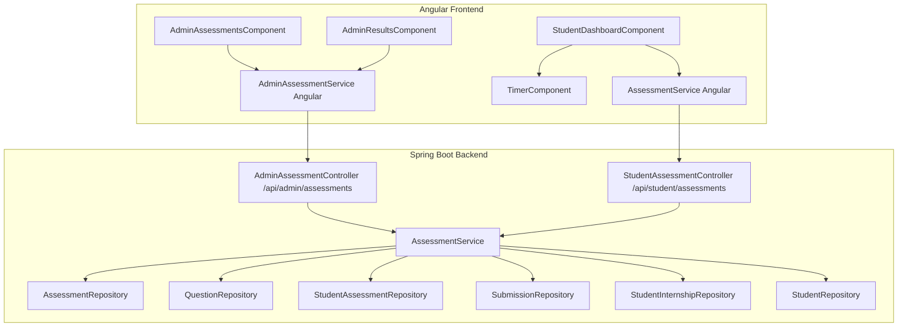
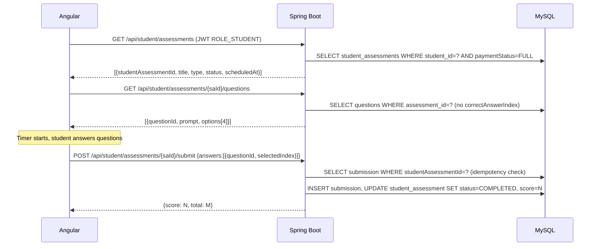
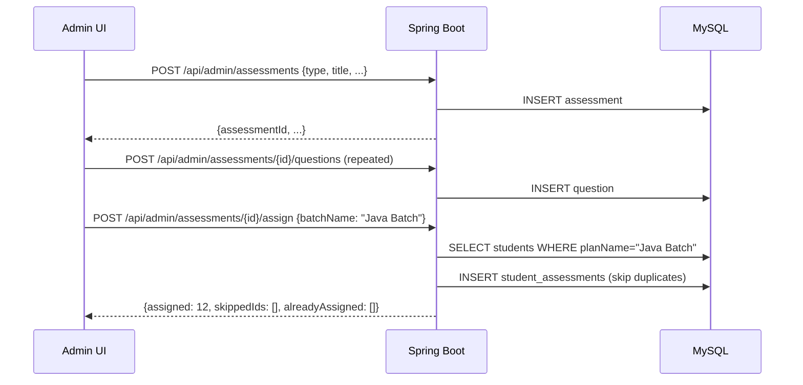

# Design Document: Student Assessment Portal

## Overview

The Student Assessment Portal extends the existing WebVibes Spring Boot 3.2 + Angular 15 platform with a full test and assessment management system. It introduces four assessment types — `MOCK_INTERVIEW`, `APTITUDE_TEST`, `MACHINE_TEST`, and `TECHNICAL_MCQ` — with admin creation/assignment workflows and student-facing test-taking UIs.

The feature integrates directly with the existing `Student`, `StudentInternship`, and `PaymentStatus` entities. Assessment visibility is gated behind `PaymentStatus.FULL`. The existing JWT infrastructure (`ROLE_STUDENT` / `ROLE_ADMIN`) is reused without modification; new endpoints are simply added to the existing `SecurityConfig` permit/restrict rules.

Key design decisions:
- New entities (`Assessment`, `Question`, `StudentAssessment`, `Submission`) live in the same `com.webvibes.entity` package.
- A dedicated `AssessmentService` handles all business logic, keeping controllers thin.
- The correct answer index is **never** serialized in student-facing DTOs — a separate `QuestionStudentDTO` omits it.
- MCQ timer enforcement is client-side (auto-submit on expiry) with server-side idempotency guard (HTTP 409 on re-submit).
- Batch assignment resolves students by `StudentInternship.planName` at assignment time.

---

## Architecture



### Request Flow — Student Takes MCQ Test



### Admin Assignment Flow



---

## Components and Interfaces

### Backend Components

#### `AdminAssessmentController` — `/api/admin/assessments`
- `POST /` — create assessment
- `GET /` — paginated list
- `GET /{assessmentId}` — full details with questions
- `DELETE /{assessmentId}` — delete assessment + student_assessments
- `POST /{assessmentId}/questions` — add question
- `DELETE /{assessmentId}/questions/{questionId}` — remove question
- `POST /{assessmentId}/assign` — assign to students or batch
- `GET /{assessmentId}/students` — list assigned students with status
- `GET /{assessmentId}/results` — all submissions/results

#### `AdminStudentAssessmentController` — `/api/admin/student-assessments`
- `GET /` — all student assessments, filterable by `assessmentType` and `assessmentStatus`
- `PUT /{studentAssessmentId}/status` — update status (used for mock interview completion)

#### `StudentAssessmentController` — `/api/student/assessments`
- `GET /` — list assigned assessments for authenticated student (payment-gated)
- `GET /{studentAssessmentId}` — full assessment details (problem statement for machine test, schedule for mock interview)
- `GET /{studentAssessmentId}/questions` — questions without correct answer (MCQ/aptitude only)
- `POST /{studentAssessmentId}/submit` — submit answers or solution

#### `AssessmentService`
- `createAssessment(CreateAssessmentRequest, String adminEmail)` → `AssessmentDTO`
- `addQuestion(Long assessmentId, CreateQuestionRequest)` → `QuestionDTO`
- `deleteQuestion(Long assessmentId, Long questionId)`
- `assignAssessment(Long assessmentId, AssignRequest)` → `AssignResponse`
- `getStudentAssessments(String studentEmail)` → `List<StudentAssessmentDTO>`
- `getAssessmentForStudent(Long studentAssessmentId, String studentEmail)` → `AssessmentDetailDTO`
- `getQuestionsForStudent(Long studentAssessmentId, String studentEmail)` → `List<QuestionStudentDTO>`
- `submitAssessment(Long studentAssessmentId, SubmitRequest, String studentEmail)` → `SubmitResponse`
- `getResults(Long assessmentId)` → `List<ResultDTO>`
- `updateStudentAssessmentStatus(Long studentAssessmentId, AssessmentStatus status)`

### Frontend Components

#### `AssessmentService` (Angular service)
- `getMyAssessments()` → `Observable<StudentAssessmentDTO[]>`
- `getAssessmentDetail(saId)` → `Observable<AssessmentDetailDTO>`
- `getQuestions(saId)` → `Observable<QuestionStudentDTO[]>`
- `submitTest(saId, answers)` → `Observable<SubmitResponse>`
- `submitMachineTest(saId, solution)` → `Observable<SubmitResponse>`

#### `AdminAssessmentService` (Angular service)
- `createAssessment(req)`, `listAssessments()`, `getAssessment(id)`, `deleteAssessment(id)`
- `addQuestion(assessmentId, req)`, `deleteQuestion(assessmentId, questionId)`
- `assignAssessment(assessmentId, req)`, `getResults(assessmentId)`
- `updateStudentAssessmentStatus(saId, status)`

#### New Angular Components
- `AssessmentListComponent` — embedded in `StudentDashboardComponent`, shows assessment cards with status badges
- `McqTestComponent` — `/student/assessments/:id/take` — timer + question list + submit
- `MachineTestComponent` — `/student/assessments/:id/machine` — problem statement + solution textarea
- `MockInterviewComponent` — `/student/assessments/:id/interview` — schedule + join button + camera notice
- `AdminAssessmentsComponent` — `/admin/assessments` — create/list/delete assessments
- `AdminAssessmentDetailComponent` — `/admin/assessments/:id` — add questions, assign, view results
- `TimerComponent` — reusable countdown timer, emits `(timerExpired)` event

---

## Data Models

### Entity: `Assessment`

```java
@Entity
@Table(name = "assessments")
public class Assessment {
    @Id @GeneratedValue(strategy = GenerationType.IDENTITY)
    private Long id;

    @Enumerated(EnumType.STRING)
    @Column(nullable = false, length = 30)
    private AssessmentType type; // MOCK_INTERVIEW, APTITUDE_TEST, MACHINE_TEST, TECHNICAL_MCQ

    @Column(nullable = false, length = 200)
    private String title;

    @Column(columnDefinition = "TEXT")
    private String description;

    // MOCK_INTERVIEW fields
    @Column(name = "scheduled_at")
    private LocalDateTime scheduledAt;

    @Column(name = "video_link", length = 500)
    private String videoLink;

    // MACHINE_TEST field
    @Column(name = "problem_statement", columnDefinition = "TEXT")
    private String problemStatement;

    // MCQ/APTITUDE fields
    @Column(name = "time_limit_minutes")
    private Integer timeLimitMinutes;

    @Column(name = "created_at", nullable = false, updatable = false)
    private LocalDateTime createdAt;

    @OneToMany(mappedBy = "assessment", cascade = CascadeType.ALL, orphanRemoval = true)
    private List<Question> questions = new ArrayList<>();

    @OneToMany(mappedBy = "assessment", cascade = CascadeType.ALL, orphanRemoval = true)
    private List<StudentAssessment> studentAssessments = new ArrayList<>();
}
```

### Entity: `Question`

```java
@Entity
@Table(name = "questions")
public class Question {
    @Id @GeneratedValue(strategy = GenerationType.IDENTITY)
    private Long id;

    @ManyToOne(fetch = FetchType.LAZY)
    @JoinColumn(name = "assessment_id", nullable = false)
    private Assessment assessment;

    @Column(nullable = false, columnDefinition = "TEXT")
    private String prompt;

    @Column(name = "option_a", nullable = false, length = 500)
    private String optionA;

    @Column(name = "option_b", nullable = false, length = 500)
    private String optionB;

    @Column(name = "option_c", nullable = false, length = 500)
    private String optionC;

    @Column(name = "option_d", nullable = false, length = 500)
    private String optionD;

    @Column(name = "correct_answer_index", nullable = false)
    private Integer correctAnswerIndex; // 0=A, 1=B, 2=C, 3=D
}
```

### Entity: `StudentAssessment`

```java
@Entity
@Table(name = "student_assessments",
       uniqueConstraints = @UniqueConstraint(columnNames = {"student_id", "assessment_id"}))
public class StudentAssessment {
    @Id @GeneratedValue(strategy = GenerationType.IDENTITY)
    private Long id;

    @ManyToOne(fetch = FetchType.LAZY)
    @JoinColumn(name = "student_id", nullable = false)
    private Student student;

    @ManyToOne(fetch = FetchType.LAZY)
    @JoinColumn(name = "assessment_id", nullable = false)
    private Assessment assessment;

    @Enumerated(EnumType.STRING)
    @Column(nullable = false, length = 20)
    private AssessmentStatus status = AssessmentStatus.PENDING;

    @Column(name = "assigned_at", nullable = false)
    private LocalDateTime assignedAt;
}
```

### Entity: `Submission`

```java
@Entity
@Table(name = "submissions")
public class Submission {
    @Id @GeneratedValue(strategy = GenerationType.IDENTITY)
    private Long id;

    @OneToOne(fetch = FetchType.LAZY)
    @JoinColumn(name = "student_assessment_id", nullable = false, unique = true)
    private StudentAssessment studentAssessment;

    // MCQ/APTITUDE: JSON array of {questionId, selectedIndex}
    @Column(name = "answers_json", columnDefinition = "TEXT")
    private String answersJson;

    // MACHINE_TEST
    @Column(name = "solution_text", columnDefinition = "TEXT")
    private String solutionText;

    // MCQ/APTITUDE score
    @Column
    private Integer score;

    @Column(name = "submitted_at", nullable = false)
    private LocalDateTime submittedAt;
}
```

### Enums

```java
public enum AssessmentType {
    MOCK_INTERVIEW, APTITUDE_TEST, MACHINE_TEST, TECHNICAL_MCQ
}

public enum AssessmentStatus {
    PENDING, UPCOMING, COMPLETED
}
```

### Key DTOs

```java
// Admin create assessment
public class CreateAssessmentRequest {
    @NotBlank String title;
    String description;
    @NotNull AssessmentType type;
    // MOCK_INTERVIEW
    LocalDateTime scheduledAt;
    String videoLink;
    // MACHINE_TEST
    @Size(min = 20) String problemStatement;
    // MCQ/APTITUDE
    @Min(1) @Max(180) Integer timeLimitMinutes;
}

// Admin add question
public class CreateQuestionRequest {
    @NotBlank String prompt;
    @NotBlank String optionA, optionB, optionC, optionD;
    @Min(0) @Max(3) @NotNull Integer correctAnswerIndex;
}

// Assign request
public class AssignRequest {
    List<Long> studentIds;   // null if using batchName
    String batchName;        // null if using studentIds
}

// Assign response
public class AssignResponse {
    int assigned;
    List<Long> skippedIds;
    List<Long> alreadyAssigned;
}

// Student-facing assessment list item
public class StudentAssessmentDTO {
    Long studentAssessmentId;
    Long assessmentId;
    String title;
    AssessmentType type;
    AssessmentStatus status;
    LocalDateTime scheduledAt; // MOCK_INTERVIEW only
    Integer timeLimitMinutes;  // MCQ/APTITUDE only
}

// Question without correct answer (student-facing)
public class QuestionStudentDTO {
    Long questionId;
    String prompt;
    String optionA, optionB, optionC, optionD;
}

// Submit request (MCQ/APTITUDE)
public class McqSubmitRequest {
    List<AnswerDTO> answers; // [{questionId, selectedIndex}]
}

// Submit request (MACHINE_TEST)
public class MachineSubmitRequest {
    @Size(min = 10) String solutionText;
}

// Submit response
public class SubmitResponse {
    Integer score;   // null for machine test
    Integer total;   // null for machine test
    AssessmentStatus status;
}

// Admin results item
public class ResultDTO {
    Long studentAssessmentId;
    String studentName;
    String studentEmail;
    AssessmentStatus status;
    Integer score;          // MCQ/APTITUDE
    Integer total;          // MCQ/APTITUDE
    String solutionText;    // MACHINE_TEST
    LocalDateTime scheduledAt; // MOCK_INTERVIEW
    LocalDateTime submittedAt;
}
```

### Security Configuration Additions

The existing `SecurityConfig` already permits `/api/student/**` for `ROLE_STUDENT` and `/api/admin/**` for `ROLE_ADMIN`. No changes needed — new endpoints fall under these existing rules.

```java
// Already in SecurityConfig — no changes required:
.requestMatchers("/api/admin/**").hasRole("ADMIN")
.requestMatchers("/api/student/**").hasRole("STUDENT")
```

The new `/api/admin/student-assessments/**` path is covered by the `/api/admin/**` rule.

### Database Schema (new tables)

```sql
CREATE TABLE assessments (
    id BIGINT AUTO_INCREMENT PRIMARY KEY,
    type VARCHAR(30) NOT NULL,
    title VARCHAR(200) NOT NULL,
    description TEXT,
    scheduled_at DATETIME,
    video_link VARCHAR(500),
    problem_statement TEXT,
    time_limit_minutes INT,
    created_at DATETIME NOT NULL
);

CREATE TABLE questions (
    id BIGINT AUTO_INCREMENT PRIMARY KEY,
    assessment_id BIGINT NOT NULL,
    prompt TEXT NOT NULL,
    option_a VARCHAR(500) NOT NULL,
    option_b VARCHAR(500) NOT NULL,
    option_c VARCHAR(500) NOT NULL,
    option_d VARCHAR(500) NOT NULL,
    correct_answer_index INT NOT NULL,
    FOREIGN KEY (assessment_id) REFERENCES assessments(id) ON DELETE CASCADE
);

CREATE TABLE student_assessments (
    id BIGINT AUTO_INCREMENT PRIMARY KEY,
    student_id BIGINT NOT NULL,
    assessment_id BIGINT NOT NULL,
    status VARCHAR(20) NOT NULL DEFAULT 'PENDING',
    assigned_at DATETIME NOT NULL,
    UNIQUE KEY uq_student_assessment (student_id, assessment_id),
    FOREIGN KEY (student_id) REFERENCES students(id),
    FOREIGN KEY (assessment_id) REFERENCES assessments(id) ON DELETE CASCADE
);

CREATE TABLE submissions (
    id BIGINT AUTO_INCREMENT PRIMARY KEY,
    student_assessment_id BIGINT NOT NULL UNIQUE,
    answers_json TEXT,
    solution_text TEXT,
    score INT,
    submitted_at DATETIME NOT NULL,
    FOREIGN KEY (student_assessment_id) REFERENCES student_assessments(id)
);
```


---

## Correctness Properties

*A property is a characteristic or behavior that should hold true across all valid executions of a system — essentially, a formal statement about what the system should do. Properties serve as the bridge between human-readable specifications and machine-verifiable correctness guarantees.*

### Property 1: MOCK_INTERVIEW creation requires scheduledAt and videoLink

*For any* assessment creation request of type `MOCK_INTERVIEW` where `scheduledAt` or `videoLink` is missing or null, the system SHALL return HTTP 400 and no assessment record SHALL be created.

**Validates: Requirements 1.2, 1.5**

### Property 2: MACHINE_TEST creation requires problemStatement of at least 20 characters

*For any* assessment creation request of type `MACHINE_TEST` where `problemStatement` is null, blank, or fewer than 20 characters, the system SHALL return HTTP 400 and no assessment record SHALL be created.

**Validates: Requirements 1.3, 1.5**

### Property 3: MCQ/APTITUDE creation requires timeLimitMinutes in [1, 180]

*For any* assessment creation request of type `TECHNICAL_MCQ` or `APTITUDE_TEST` where `timeLimitMinutes` is null, less than 1, or greater than 180, the system SHALL return HTTP 400 and no assessment record SHALL be created.

**Validates: Requirements 1.4, 1.5**

### Property 4: Assessment list count reflects created assessments

*For any* sequence of N valid assessment creation requests, the `GET /api/admin/assessments` endpoint SHALL return a total count of at least N assessments.

**Validates: Requirements 1.6**

### Property 5: Assessment detail round-trip

*For any* created assessment (with questions for MCQ types), retrieving it via `GET /api/admin/assessments/{id}` SHALL return a response whose `title`, `type`, and type-specific fields match the original creation request.

**Validates: Requirements 1.7**

### Property 6: Assessment deletion removes assessment and all student assignments

*For any* assessment that has been assigned to one or more students, deleting it via `DELETE /api/admin/assessments/{id}` SHALL result in the assessment being unretrievable (HTTP 404) and all associated `StudentAssessment` records being removed.

**Validates: Requirements 1.8**

### Property 7: Questions can only be added to MCQ/APTITUDE assessments

*For any* assessment of type `MOCK_INTERVIEW` or `MACHINE_TEST`, a request to `POST /api/admin/assessments/{id}/questions` SHALL return HTTP 400 with the message "Questions are not applicable for this assessment type" and no question SHALL be persisted.

**Validates: Requirements 2.2, 2.3**

### Property 8: correctAnswerIndex must be in range [0, 3]

*For any* question creation request where `correctAnswerIndex` is an integer outside the range [0, 3], the system SHALL return HTTP 400 and no question record SHALL be created.

**Validates: Requirements 2.3, 2.4**

### Property 9: Question add/delete round-trip

*For any* MCQ/APTITUDE assessment, adding a question and then deleting it SHALL result in the assessment's question list returning to its prior state (the deleted question is no longer present in `GET /api/admin/assessments/{id}`).

**Validates: Requirements 2.1, 2.4, 2.5**

### Property 10: Individual assignment creates exactly the right StudentAssessment records

*For any* assignment request with a list of valid student IDs, the number of newly created `StudentAssessment` records SHALL equal the count of IDs that were not already assigned, and each created record SHALL reference the correct student and assessment.

**Validates: Requirements 3.1, 3.3, 3.4**

### Property 11: Batch assignment covers all students in the batch

*For any* batch name, assigning an assessment to that batch SHALL create a `StudentAssessment` for every student whose `StudentInternship.planName` matches the batch name (excluding already-assigned students).

**Validates: Requirements 3.2**

### Property 12: Duplicate assignment is idempotent

*For any* student already assigned to an assessment, re-assigning that same student SHALL not create a duplicate `StudentAssessment` record, and the student's ID SHALL appear in the `alreadyAssigned` list of the response.

**Validates: Requirements 3.4**

### Property 13: Initial StudentAssessment status is correct for each assessment type

*For any* newly created `StudentAssessment`, the initial `status` SHALL be `UPCOMING` when the assessment type is `MOCK_INTERVIEW`, and `PENDING` for all other assessment types.

**Validates: Requirements 3.5, 3.6, 3.7**

### Property 14: Payment gate — non-FULL students receive empty assessment list

*For any* student whose `StudentInternship.paymentStatus` is `NOT_PAID` or `PARTIAL`, the `GET /api/student/assessments` endpoint SHALL return an empty list with HTTP 200.

**Validates: Requirements 4.1, 4.2, 10.2**

### Property 15: FULL-payment students receive all their assigned assessments

*For any* student with `paymentStatus = FULL` who has N assigned assessments, the `GET /api/student/assessments` endpoint SHALL return exactly those N assessments.

**Validates: Requirements 4.3**

### Property 16: correctAnswerIndex is never present in student-facing question responses

*For any* MCQ/APTITUDE assessment and any authenticated student assigned to it, the `GET /api/student/assessments/{saId}/questions` response SHALL not contain a `correctAnswerIndex` field in any question object.

**Validates: Requirements 5.1, 10.4**

### Property 17: MCQ score calculation is correct

*For any* set of student answers submitted for an MCQ/APTITUDE test, the returned `score` SHALL equal the count of answers where `selectedIndex` matches the question's `correctAnswerIndex`.

**Validates: Requirements 5.6, 5.8**

### Property 18: Submission sets StudentAssessment to COMPLETED

*For any* valid submission (MCQ, machine test, or mock interview confirmation), the `StudentAssessment.status` SHALL be `COMPLETED` after the submission is processed.

**Validates: Requirements 5.6, 6.5**

### Property 19: Re-submission is rejected with HTTP 409

*For any* `StudentAssessment` already in `COMPLETED` status, any subsequent submission request SHALL return HTTP 409 with the message "Assessment already submitted" and the existing `Submission` record SHALL remain unchanged.

**Validates: Requirements 5.7, 6.6, 10.5**

### Property 20: Students cannot access assessments not assigned to them

*For any* student and any `StudentAssessment` record belonging to a different student, all requests to the questions, detail, or submit endpoints for that record SHALL return HTTP 403.

**Validates: Requirements 5.9, 10.1, 10.3**

### Property 21: Machine test solution minimum length is enforced

*For any* machine test submission where `solutionText` is fewer than 10 characters, the system SHALL return HTTP 400 with the message "Solution must be at least 10 characters" and no `Submission` record SHALL be created.

**Validates: Requirements 6.3, 6.4**

### Property 22: Admin can update any StudentAssessment status

*For any* `StudentAssessment` record, a `PUT /api/admin/student-assessments/{saId}/status` request with a valid `AssessmentStatus` value SHALL update the record's status to the provided value.

**Validates: Requirements 7.5, 7.6**

### Property 23: Results endpoint returns all assigned students

*For any* assessment with N assigned students, the `GET /api/admin/assessments/{assessmentId}/results` endpoint SHALL return exactly N result records, one per `StudentAssessment`.

**Validates: Requirements 8.1**

### Property 24: MCQ/APTITUDE results include score and total

*For any* completed `StudentAssessment` of type `TECHNICAL_MCQ` or `APTITUDE_TEST`, the result record returned by the results endpoint SHALL include a non-null `score` and `total` matching the submission data.

**Validates: Requirements 8.2**

---

## Error Handling

| Scenario | HTTP Status | Response Body |
|---|---|---|
| Missing required field for assessment type | 400 | `{errors: {field: "message"}}` |
| Question added to MOCK_INTERVIEW or MACHINE_TEST | 400 | `{message: "Questions are not applicable for this assessment type"}` |
| correctAnswerIndex out of range | 400 | `{errors: {correctAnswerIndex: "Must be between 0 and 3"}}` |
| Assessment ID not found | 404 | `{message: "Assessment not found"}` |
| Student ID not found during assignment | — | Skipped; ID added to `skippedIds` in response |
| Student accesses assessment not assigned to them | 403 | `{message: "Access denied"}` |
| Student with non-FULL payment accesses content | 403 | `{message: "Complete your payment to access assessments"}` |
| Re-submission on COMPLETED assessment | 409 | `{message: "Assessment already submitted"}` |
| Machine test solution too short | 400 | `{message: "Solution must be at least 10 characters"}` |
| timeLimitMinutes out of range | 400 | `{errors: {timeLimitMinutes: "Must be between 1 and 180"}}` |
| Expired/missing JWT | 401 | Spring Security default 401 |
| Admin endpoint accessed with ROLE_STUDENT | 403 | Spring Security default 403 |

All errors are handled by the existing `GlobalExceptionHandler`. New exception types to add:
- `AssessmentNotFoundException` (→ 404)
- `AssessmentAlreadySubmittedException` (→ 409)
- `AssessmentAccessDeniedException` (→ 403)
- `InvalidAssessmentTypeOperationException` (→ 400)

---

## Testing Strategy

### Unit Tests (JUnit 5 + Mockito)

Focus on specific examples, edge cases, and integration points:

- `AssessmentServiceTest`
  - Create assessment with valid data for each type
  - Create MOCK_INTERVIEW without scheduledAt → expect 400
  - Create MACHINE_TEST with 19-char problem statement → expect 400
  - Create MCQ with timeLimitMinutes=0 → expect 400
  - Add question to MACHINE_TEST → expect 400
  - Delete assessment cascades to student_assessments
  - Assign to non-existent student ID → appears in skippedIds
  - Assign duplicate → appears in alreadyAssigned, no duplicate record
- `SubmissionServiceTest`
  - MCQ score calculation: all correct, all wrong, mixed
  - Re-submission on COMPLETED → AssessmentAlreadySubmittedException
  - Machine test solution < 10 chars → expect 400
- `StudentAssessmentControllerTest`
  - Student with PARTIAL payment → empty list
  - Student with FULL payment → returns assigned assessments
  - Student accesses another student's assessment → 403
  - Questions response has no correctAnswerIndex field

### Property-Based Tests (jqwik)

Each property test uses `@Property(tries = 100)`. Tag format in comments:
`// Feature: student-assessment-portal, Property N: <property_text>`

- **Property 2**: Generate random strings of length 0–19 as problemStatement for MACHINE_TEST → assert HTTP 400, no DB record
- **Property 3**: Generate random integers outside [1, 180] as timeLimitMinutes → assert HTTP 400, no DB record
- **Property 7**: Generate random question creation requests targeting MOCK_INTERVIEW or MACHINE_TEST assessments → assert HTTP 400
- **Property 8**: Generate random integers outside [0, 3] as correctAnswerIndex → assert HTTP 400, no question created
- **Property 10**: Generate random lists of valid student IDs, assign, assert created count = input count - duplicates
- **Property 12**: Generate random student/assessment pairs, assign twice, assert no duplicate StudentAssessment record
- **Property 14**: Generate students with NOT_PAID or PARTIAL status, call GET /api/student/assessments → assert empty list
- **Property 16**: Generate random MCQ assessments with questions, call student questions endpoint → assert no correctAnswerIndex in any item
- **Property 17**: Generate random answer sets with known correct answers, submit → assert score = count of matching answers
- **Property 19**: Generate random completed StudentAssessments, submit again → assert HTTP 409, Submission unchanged
- **Property 20**: Generate random student/assessment pairs where student is not the assignee → assert HTTP 403
- **Property 21**: Generate random strings of length 0–9 as solutionText → assert HTTP 400, no Submission created

### Angular Component Tests (Jasmine/Karma)

- `AssessmentListComponent` — shows "Complete your payment" message when paymentStatus != FULL
- `AssessmentListComponent` — shows assessment cards with correct status badges when paymentStatus = FULL
- `McqTestComponent` — timer starts at configured timeLimitMinutes, counts down
- `McqTestComponent` — auto-submits when timer reaches zero
- `McqTestComponent` — submit button disabled until at least one answer selected
- `MachineTestComponent` — submit button disabled when solution textarea is empty
- `MockInterviewComponent` — "Join Interview" button opens videoLink in new tab
- `MockInterviewComponent` — camera/microphone notice is displayed
