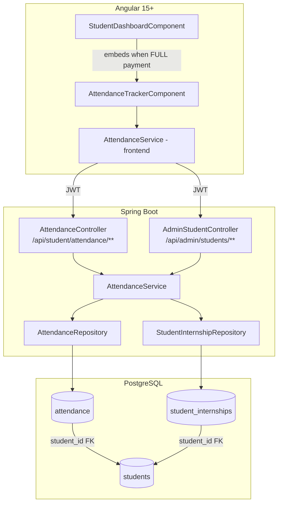

# Design Document: Student Attendance Tracker

## Overview

The Student Attendance Tracker adds a corporate-style clock-in/clock-out system to the existing WebVibes student portal. Students record daily attendance during two distinct program phases (Training and Internship), each with admin-configured date ranges. The system computes attendance status automatically (PRESENT, LATE, ABSENT), exposes a monthly calendar view, and provides summary statistics. Admins configure phase dates per student and can view any student's attendance history.

The feature integrates into the existing Spring Boot + Angular + PostgreSQL + JWT stack without introducing new infrastructure. It extends the `StudentInternship` entity, adds a new `Attendance` entity, and embeds a new `AttendanceTrackerComponent` inside the existing student dashboard (visible only to full-payment students).

---

## Architecture



**Key architectural decisions:**

- Absent days are computed on-the-fly during calendar/summary queries rather than via a scheduled job. This avoids stale data and simplifies the schema.
- The late threshold is read from `application.properties` via `@Value`, making it configurable without code changes.
- Phase detection is a pure service-layer computation over the four date fields on `StudentInternship` — no separate phase entity is needed.
- The `AttendanceTrackerComponent` is embedded in the existing student dashboard and gated behind `paymentStatus === 'FULL'`, consistent with how assessments are gated.

---

## Components and Interfaces

### Backend Components

#### Enums

```java
// com.webvibes.entity.AttendancePhase
public enum AttendancePhase { TRAINING, INTERNSHIP }

// com.webvibes.entity.AttendanceStatus
public enum AttendanceStatus { PRESENT, LATE, ABSENT }
```

#### AttendanceRepository

```java
public interface AttendanceRepository extends JpaRepository<Attendance, Long> {
    Optional<Attendance> findByStudentAndDateAndPhase(Student student, LocalDate date, AttendancePhase phase);
    List<Attendance> findByStudentAndPhaseAndDateBetween(Student student, AttendancePhase phase, LocalDate start, LocalDate end);
}
```

#### AttendanceService (backend)

| Method | Description |
|---|---|
| `checkIn(studentEmail)` | Creates Attendance record; sets status PRESENT or LATE based on late threshold |
| `checkOut(studentEmail)` | Updates checkOutTime and calculates hoursWorked |
| `getTodayStatus(studentEmail)` | Returns AttendanceTodayDTO with canCheckIn/canCheckOut flags |
| `getMonthlyCalendar(studentEmail, year, month, phase)` | Returns list of CalendarDayDTO for every day in the month |
| `getSummary(studentEmail, phase)` | Returns AttendanceSummaryDTO with aggregated stats |
| `detectActivePhase(studentEmail)` | Returns AttendancePhase or null based on today's date vs phase date ranges |
| `getMonthlyCalendarForAdmin(studentId, year, month, phase)` | Admin variant — looks up student by ID |

#### AttendanceController

Base path: `/api/student/attendance` — secured with `@PreAuthorize("hasRole('STUDENT')")`

| Method | Path | Description |
|---|---|---|
| POST | `/checkin` | Check in for today |
| POST | `/checkout` | Check out for today |
| GET | `/today` | Get today's attendance status + flags |
| GET | `/monthly?year=&month=&phase=` | Get monthly calendar data |
| GET | `/summary?phase=` | Get phase summary statistics |

#### AdminStudentController extensions

| Method | Path | Description |
|---|---|---|
| PUT | `/api/admin/students/{id}/phase-dates` | Set/update phase dates for a student |
| GET | `/api/admin/students/{id}/attendance?phase=&year=&month=` | View student's monthly attendance |

### Frontend Components

#### AttendanceService (Angular)

```typescript
// src/app/services/attendance.service.ts
checkIn(): Observable<AttendanceTodayDTO>
checkOut(): Observable<AttendanceTodayDTO>
getToday(): Observable<AttendanceTodayDTO>
getMonthly(year: number, month: number, phase: string): Observable<CalendarDayDTO[]>
getSummary(phase: string): Observable<AttendanceSummaryDTO>
updatePhaseDates(studentId: number, req: PhaseDatesRequest): Observable<any>
getAdminMonthly(studentId: number, year: number, month: number, phase: string): Observable<CalendarDayDTO[]>
```

#### AttendanceTrackerComponent

Selector: `app-attendance-tracker`  
Embedded in `student-dashboard.component.html` inside the `paymentStatus === 'FULL'` block.

Internal structure:

```
AttendanceTrackerComponent
├── Phase header (active phase badge + phase date range)
├── Live clock (setInterval every 1s)
├── Today's card
│   ├── Check-in time / Check-out time / Hours worked / Status badge
│   └── Check-In button OR Check-Out button (mutually exclusive)
├── Phase tab switcher (TRAINING | INTERNSHIP)
├── Summary stats row (Present / Late / Absent / Attendance %)
└── Monthly calendar grid
    ├── 7-column grid (Mon–Sun header)
    ├── Color-coded day cells
    └── Prev / Next month navigation
```

#### Admin extension (AdminStudentsComponent)

Add a collapsible "Phase Dates" section per student row with:
- 4 date inputs: trainingStartDate, trainingEndDate, internshipStartDate, internshipEndDate
- Save button → calls `PUT /api/admin/students/{id}/phase-dates`
- Pre-populated from existing student data
- Client-side validation: end date must not be before start date

---

## Data Models

### Database Schema

#### New table: `attendance`

```sql
CREATE TABLE attendance (
    id              BIGSERIAL PRIMARY KEY,
    student_id      BIGINT NOT NULL REFERENCES students(id),
    phase           VARCHAR(20) NOT NULL,          -- TRAINING | INTERNSHIP
    date            DATE NOT NULL,
    check_in_time   TIMESTAMP NOT NULL,
    check_out_time  TIMESTAMP,                     -- nullable until checkout
    status          VARCHAR(10) NOT NULL,           -- PRESENT | LATE | ABSENT
    hours_worked    DOUBLE PRECISION,              -- nullable until checkout
    CONSTRAINT uq_attendance UNIQUE (student_id, date, phase)
);
```

#### Modified table: `student_internships`

```sql
ALTER TABLE student_internships
    ADD COLUMN training_start_date   DATE,
    ADD COLUMN training_end_date     DATE,
    ADD COLUMN internship_start_date DATE,
    ADD COLUMN internship_end_date   DATE;
```

### JPA Entities

#### Attendance entity

```java
@Entity
@Table(name = "attendance",
       uniqueConstraints = @UniqueConstraint(columnNames = {"student_id", "date", "phase"}))
public class Attendance {
    @Id @GeneratedValue(strategy = GenerationType.IDENTITY)
    private Long id;

    @ManyToOne(fetch = FetchType.LAZY)
    @JoinColumn(name = "student_id", nullable = false)
    private Student student;

    @Enumerated(EnumType.STRING)
    @Column(nullable = false, length = 20)
    private AttendancePhase phase;

    @Column(nullable = false)
    private LocalDate date;

    @Column(name = "check_in_time", nullable = false)
    private LocalDateTime checkInTime;

    @Column(name = "check_out_time")
    private LocalDateTime checkOutTime;   // nullable

    @Enumerated(EnumType.STRING)
    @Column(nullable = false, length = 10)
    private AttendanceStatus status;

    @Column(name = "hours_worked")
    private Double hoursWorked;           // nullable
}
```

#### StudentInternship additions

```java
// Added to existing StudentInternship entity
@Column(name = "training_start_date")
private LocalDate trainingStartDate;

@Column(name = "training_end_date")
private LocalDate trainingEndDate;

@Column(name = "internship_start_date")
private LocalDate internshipStartDate;

@Column(name = "internship_end_date")
private LocalDate internshipEndDate;
```

### DTOs

#### AttendanceTodayDTO

```java
public class AttendanceTodayDTO {
    private LocalDate date;
    private AttendancePhase activePhase;   // null if no active phase
    private LocalDateTime checkInTime;     // null if not checked in
    private LocalDateTime checkOutTime;    // null if not checked out
    private AttendanceStatus status;       // null if not checked in
    private Double hoursWorked;            // null if not checked out
    private boolean canCheckIn;
    private boolean canCheckOut;
}
```

#### CalendarDayDTO

```java
public class CalendarDayDTO {
    private LocalDate date;
    private String displayStatus;  // PRESENT | LATE | ABSENT | WEEKEND | FUTURE | OUT_OF_PHASE
    private LocalDateTime checkInTime;   // null unless PRESENT or LATE
    private LocalDateTime checkOutTime;  // null unless checked out
}
```

#### AttendanceSummaryDTO

```java
public class AttendanceSummaryDTO {
    private AttendancePhase phase;
    private LocalDate startDate;
    private LocalDate endDate;
    private int presentDays;
    private int lateDays;
    private int absentDays;
    private int totalWorkingDays;
    private double attendancePercentage;  // rounded to 1 decimal place
}
```

#### PhaseDatesRequest

```java
public class PhaseDatesRequest {
    private LocalDate trainingStartDate;
    private LocalDate trainingEndDate;
    private LocalDate internshipStartDate;
    private LocalDate internshipEndDate;
}
```

### TypeScript Models

```typescript
// src/app/models/attendance.models.ts
export interface AttendanceTodayDTO {
  date: string;
  activePhase: 'TRAINING' | 'INTERNSHIP' | null;
  checkInTime: string | null;
  checkOutTime: string | null;
  status: 'PRESENT' | 'LATE' | 'ABSENT' | null;
  hoursWorked: number | null;
  canCheckIn: boolean;
  canCheckOut: boolean;
}

export interface CalendarDayDTO {
  date: string;
  displayStatus: 'PRESENT' | 'LATE' | 'ABSENT' | 'WEEKEND' | 'FUTURE' | 'OUT_OF_PHASE';
  checkInTime: string | null;
  checkOutTime: string | null;
}

export interface AttendanceSummaryDTO {
  phase: 'TRAINING' | 'INTERNSHIP';
  startDate: string;
  endDate: string;
  presentDays: number;
  lateDays: number;
  absentDays: number;
  totalWorkingDays: number;
  attendancePercentage: number;
}

export interface PhaseDatesRequest {
  trainingStartDate: string | null;
  trainingEndDate: string | null;
  internshipStartDate: string | null;
  internshipEndDate: string | null;
}
```

### API Contracts

#### POST /api/student/attendance/checkin

Request: (none — student identity from JWT)

Response 200:
```json
{
  "date": "2025-01-15",
  "activePhase": "TRAINING",
  "checkInTime": "2025-01-15T09:45:00",
  "checkOutTime": null,
  "status": "PRESENT",
  "hoursWorked": null,
  "canCheckIn": false,
  "canCheckOut": true
}
```

Error responses: 400 (weekend / no active phase), 409 (already checked in)

#### POST /api/student/attendance/checkout

Response 200: same shape as check-in, with checkOutTime and hoursWorked populated.

Error responses: 400 (no check-in / weekend / no active phase), 409 (already checked out)

#### GET /api/student/attendance/today

Response 200: `AttendanceTodayDTO`

#### GET /api/student/attendance/monthly?year=2025&month=1&phase=TRAINING

Response 200:
```json
[
  { "date": "2025-01-01", "displayStatus": "PRESENT", "checkInTime": "2025-01-01T09:30:00", "checkOutTime": "2025-01-01T18:00:00" },
  { "date": "2025-01-04", "displayStatus": "LATE",    "checkInTime": "2025-01-04T10:30:00", "checkOutTime": null },
  { "date": "2025-01-05", "displayStatus": "ABSENT",  "checkInTime": null, "checkOutTime": null },
  { "date": "2025-01-06", "displayStatus": "FUTURE",  "checkInTime": null, "checkOutTime": null },
  { "date": "2025-01-11", "displayStatus": "WEEKEND", "checkInTime": null, "checkOutTime": null }
]
```

Error responses: 400 (phase not configured)

#### GET /api/student/attendance/summary?phase=TRAINING

Response 200:
```json
{
  "phase": "TRAINING",
  "startDate": "2025-01-01",
  "endDate": "2025-03-31",
  "presentDays": 40,
  "lateDays": 5,
  "absentDays": 3,
  "totalWorkingDays": 48,
  "attendancePercentage": 93.8
}
```

Error responses: 400 (phase not configured)

#### PUT /api/admin/students/{id}/phase-dates

Request:
```json
{
  "trainingStartDate": "2025-01-01",
  "trainingEndDate": "2025-03-31",
  "internshipStartDate": "2025-04-01",
  "internshipEndDate": "2025-06-30"
}
```

Response 200: updated `AdminStudentDTO`

Error responses: 400 (end before start), 404 (student not found)

#### GET /api/admin/students/{id}/attendance?phase=TRAINING&year=2025&month=1

Response 200: same `CalendarDayDTO[]` structure as student endpoint.

---

## Correctness Properties


*A property is a characteristic or behavior that should hold true across all valid executions of a system — essentially, a formal statement about what the system should do. Properties serve as the bridge between human-readable specifications and machine-verifiable correctness guarantees.*

### Property 1: Phase Dates Round-Trip

*For any* student and any set of valid phase dates (where end dates are not before start dates), submitting those dates via `PUT /api/admin/students/{id}/phase-dates` and then reading back the student's `StudentInternship` record should return exactly the same four date values that were submitted.

**Validates: Requirements 1.1, 1.2**

### Property 2: Invalid Date Range Rejected

*For any* phase date pair where the end date is strictly before the start date (for either training or internship), the system should return HTTP 400 and must not persist any changes to the student's phase dates.

**Validates: Requirements 1.3, 1.4**

### Property 3: Phase Detection Correctness

*For any* student with configured phase dates and any given date `d`:
- If `d` falls within `[trainingStartDate, trainingEndDate]`, the detected phase must be TRAINING.
- If `d` falls within `[internshipStartDate, internshipEndDate]` and not within the training range, the detected phase must be INTERNSHIP.
- If `d` falls within neither range, the detected phase must be null (no active phase).

**Validates: Requirements 2.1, 2.2, 2.3**

### Property 4: Check-In Status Assignment

*For any* check-in time `t` and configured late threshold `L`:
- If `t` is at or before `L` on the same day, the resulting `AttendanceStatus` must be PRESENT.
- If `t` is after `L` on the same day, the resulting `AttendanceStatus` must be LATE.

**Validates: Requirements 3.2, 3.3, 9.1**

### Property 5: Duplicate Check-In Rejected

*For any* student who has already checked in today for their active phase, a second check-in request must return HTTP 409 and the original `Attendance` record must remain unchanged (no duplicate record created, no overwrite of checkInTime or status).

**Validates: Requirements 3.4**

### Property 6: Hours Worked Calculation

*For any* check-in time `t_in` and check-out time `t_out` where `t_out > t_in`, the `hoursWorked` value stored on the `Attendance` record must equal `(t_out - t_in)` expressed as decimal hours, rounded to two decimal places.

**Validates: Requirements 4.2**

### Property 7: Duplicate Check-Out Rejected

*For any* student who has already checked out today, a second check-out request must return HTTP 409 and the original `checkOutTime` and `hoursWorked` values must remain unchanged.

**Validates: Requirements 4.4**

### Property 8: Calendar Completeness

*For any* valid year and month, the monthly calendar response must contain exactly `N` entries where `N` is the number of days in that month, with one entry per calendar date and no duplicates.

**Validates: Requirements 7.1**

### Property 9: Calendar DisplayStatus Correctness

*For any* student, phase, year, and month, every day entry in the calendar response must have a `displayStatus` that satisfies all of the following rules simultaneously:
- Saturday or Sunday → WEEKEND
- Future date (after today) → FUTURE
- Date outside the phase date range → OUT_OF_PHASE
- Past working day within phase range with an Attendance record → PRESENT or LATE (matching the record's status)
- Past working day within phase range with no Attendance record → ABSENT

No day may be classified as ABSENT if it is a weekend, a future date, or outside the phase range.

**Validates: Requirements 5.1, 5.2, 5.3, 5.4, 7.2, 7.3, 7.4, 7.5, 7.6, 7.7**

### Property 10: Summary Statistics Correctness

*For any* student and phase with configured dates, the summary response must satisfy:
- `presentDays` equals the count of Attendance records with status PRESENT in the phase range up to today
- `lateDays` equals the count of Attendance records with status LATE in the phase range up to today
- `absentDays` equals the count of past working days in the phase range with no Attendance record
- `totalWorkingDays` equals `presentDays + lateDays + absentDays`
- `attendancePercentage` equals `(presentDays + lateDays) / totalWorkingDays * 100` rounded to one decimal place (or 0.0 if totalWorkingDays is 0)

**Validates: Requirements 8.1, 8.2**

### Property 11: JWT Identity Enforcement

*For any* authenticated student making a check-in, check-out, or today-status request, the `student_id` on the resulting or returned `Attendance` record must match the student whose email is encoded in the JWT token — regardless of any other parameters in the request.

**Validates: Requirements 15.3**

---

## Error Handling

| Scenario | HTTP Status | Response body |
|---|---|---|
| Check-in on weekend | 400 | `{ "error": "Check-in is not available on weekends" }` |
| Check-in with no active phase | 400 | `{ "error": "No active phase configured for today" }` |
| Check-in already done today | 409 | `{ "error": "Already checked in today" }` |
| Check-out without prior check-in | 400 | `{ "error": "Cannot check out without a prior check-in today" }` |
| Check-out already done today | 409 | `{ "error": "Already checked out today" }` |
| Check-out on weekend | 400 | `{ "error": "Check-out is not available on weekends" }` |
| Monthly/summary with unconfigured phase | 400 | `{ "error": "Phase TRAINING is not configured for this student" }` |
| Phase dates: end before start | 400 | `{ "error": "trainingEndDate must not be before trainingStartDate" }` |
| Student not found (admin endpoints) | 404 | `{ "error": "Student not found" }` |
| Unauthenticated request | 401 | Spring Security default |
| ROLE_STUDENT accessing admin endpoint | 403 | Spring Security default |

All error responses use the existing `GlobalExceptionHandler` pattern. New exception classes to add:
- `AttendanceAlreadyExistsException` (→ 409)
- `AttendanceNotFoundException` (→ 400)
- `NoActivePhaseException` (→ 400)
- `PhaseNotConfiguredException` (→ 400)

---

## Testing Strategy

### Unit Tests (JUnit 5 + Mockito)

Focus on specific examples, edge cases, and integration points:

- `AttendanceServiceTest`: check-in on a weekend returns exception; check-in with no active phase returns exception; check-out without prior check-in returns exception; phase not yet started returns zero summary.
- `AttendanceControllerTest` (MockMvc): unauthenticated request returns 401; ROLE_STUDENT on admin endpoint returns 403; valid check-in returns 200 with correct body shape.
- `AdminStudentControllerTest`: phase date update with end before start returns 400; student not found returns 404.
- `AttendanceService.detectActivePhase`: boundary dates (first day of range, last day of range, day before, day after).

### Property-Based Tests (jqwik — Java property-based testing library)

Each property test runs a minimum of 100 iterations. Each test is tagged with a comment referencing the design property it validates.

Tag format: `// Feature: student-attendance-tracker, Property {N}: {property_text}`

| Property | Test class | Generator inputs |
|---|---|---|
| P1: Phase dates round-trip | `PhaseDatesPropertyTest` | Random valid LocalDate pairs (end ≥ start) |
| P2: Invalid date range rejected | `PhaseDatesPropertyTest` | Random LocalDate pairs where end < start |
| P3: Phase detection correctness | `PhaseDetectionPropertyTest` | Random phase date ranges + random query dates |
| P4: Check-in status assignment | `CheckInStatusPropertyTest` | Random LocalTime values for check-in + random threshold |
| P5: Duplicate check-in rejected | `CheckInPropertyTest` | Random students + random valid check-in scenarios |
| P6: Hours worked calculation | `HoursWorkedPropertyTest` | Random LocalDateTime pairs (t_out > t_in) |
| P7: Duplicate check-out rejected | `CheckOutPropertyTest` | Random students + random valid check-out scenarios |
| P8: Calendar completeness | `CalendarPropertyTest` | Random year/month combinations (1–12, valid years) |
| P9: Calendar displayStatus correctness | `CalendarPropertyTest` | Random phase ranges + random attendance record sets |
| P10: Summary statistics correctness | `SummaryPropertyTest` | Random attendance record sets within random phase ranges |
| P11: JWT identity enforcement | `SecurityPropertyTest` | Random student accounts + JWT tokens |

**Frontend property-based tests** use `fast-check` (TypeScript PBT library):

- `AttendanceService` HTTP mapping: for any `CalendarDayDTO[]` response, the Angular service must return an array of the same length with all `displayStatus` values preserved.
- `AttendanceTrackerComponent` button state: for any `AttendanceTodayDTO`, the rendered component must show exactly one of {Check-In button, Check-Out button, completed state} — never both buttons simultaneously.
- Calendar grid completeness: for any month, the rendered grid must contain exactly the correct number of day cells.

**Dual testing rationale**: Unit tests catch concrete bugs at specific boundary values (e.g., exactly midnight, exactly the late threshold time). Property tests verify the general rules hold across the full input space, catching off-by-one errors in date range logic, rounding errors in hours calculation, and classification bugs in calendar logic that unit tests with fixed examples would miss.
