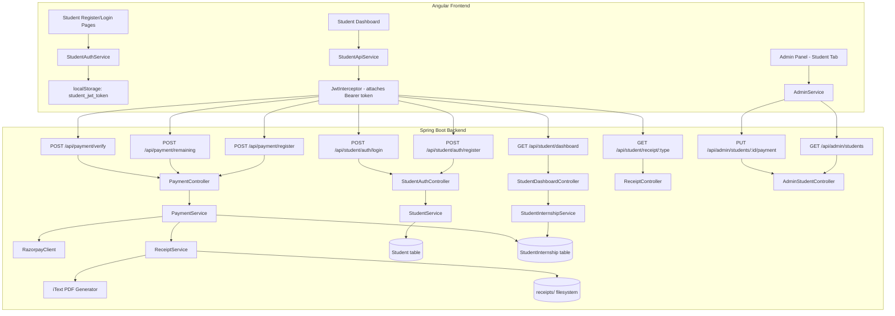
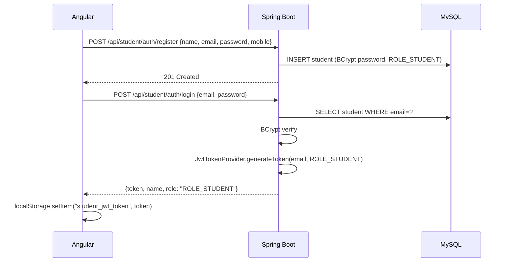
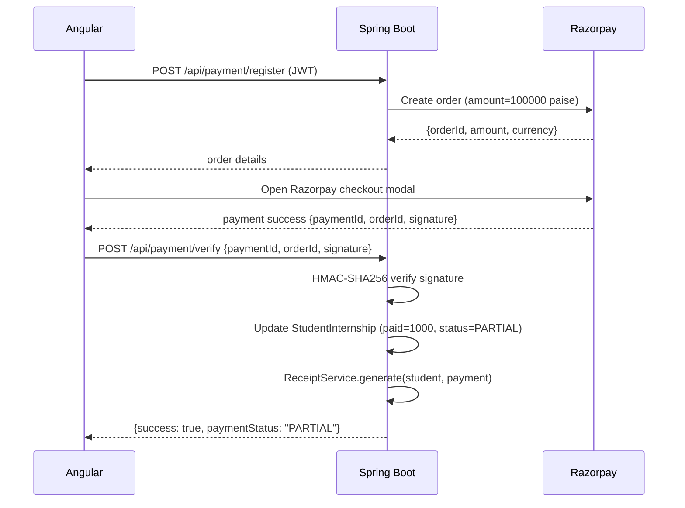

# Design Document: Student Portal — Internship Management

## Overview

The Student Portal extends the existing WebVibes Spring Boot + Angular platform with a self-service internship enrollment and payment system. Students register, log in, view their assigned internship plan, accept an agreement, make payments via Razorpay, and download PDF receipts. Admins manage student records and payment statuses through the existing admin panel.

The key architectural decision is to keep student authentication **separate** from the existing admin auth context. Students authenticate against a dedicated `Student` entity using `ROLE_STUDENT`, while admins continue to use `AdminUser` with `ROLE_ADMIN`. Both share the same `JwtTokenProvider` and `JwtAuthenticationFilter` infrastructure — the filter already loads `UserDetails` by username, so we extend `CustomUserDetailsService` to look up students by email when the admin lookup fails, or introduce a dedicated `StudentUserDetailsService` registered as a secondary `UserDetailsService`.

The cleanest approach is a **dedicated `StudentUserDetailsService`** that is wired into a separate `AuthenticationProvider` bean, avoiding any coupling with the existing admin auth path.

---

## Architecture



### Auth Flow



### Payment Flow



---

## Components and Interfaces

### Backend Components

#### `StudentAuthController` — `/api/student/auth`
- `POST /register` — public, validates and creates student
- `POST /login` — public, returns JWT

#### `StudentDashboardController` — `/api/student`
- `GET /dashboard` — requires `ROLE_STUDENT`, returns `DashboardResponse`
- `GET /receipt/{paymentType}` — requires `ROLE_STUDENT`, streams PDF

#### `PaymentController` — `/api/payment`
- `POST /register` — requires `ROLE_STUDENT`, creates Razorpay order for ₹1000
- `POST /remaining` — requires `ROLE_STUDENT`, creates Razorpay order for remaining amount
- `POST /verify` — requires `ROLE_STUDENT`, verifies signature and updates DB

#### `AdminStudentController` — `/api/admin/students`
- `GET /` — requires `ROLE_ADMIN`, paginated list with optional `paymentStatus` filter
- `PUT /{studentId}/payment` — requires `ROLE_ADMIN`, manual payment update

#### `StudentService`
- `register(StudentRegisterRequest)` → `Student`
- `findByEmail(String)` → `Optional<Student>`

#### `StudentInternshipService`
- `getDashboard(String email)` → `DashboardResponse`
- `updatePayment(Long studentId, PaymentUpdateRequest)` → `StudentInternship`

#### `PaymentService`
- `createRegistrationOrder(String email)` → `RazorpayOrderResponse`
- `createRemainingOrder(String email)` → `RazorpayOrderResponse`
- `verifyAndRecord(PaymentVerifyRequest, String email)` → `PaymentVerifyResponse`

#### `ReceiptService`
- `generateReceipt(Student, StudentInternship, String paymentType, String transactionId)` → `String` (file path)

#### `StudentUserDetailsService` (implements `UserDetailsService`)
- Loads student by email for Spring Security authentication

### Frontend Components

#### `StudentAuthService` (Angular service)
- Separate from existing `AuthService` — uses `student_jwt_token` key in localStorage
- `register(req)`, `login(req)`, `logout()`, `getToken()`, `isStudentAuthenticated()`

#### `StudentGuard` (Angular route guard)
- Checks `StudentAuthService.isStudentAuthenticated()`
- Redirects to `/student/login` if not authenticated

#### Pages/Components
- `StudentRegisterComponent` — `/student/register`
- `StudentLoginComponent` — `/student/login`
- `StudentDashboardComponent` — `/student/dashboard` (guarded)
- `AdminStudentsComponent` — `/admin/students` (guarded by existing `AuthGuard`)

---

## Data Models

### Entity: `Student`

```java
@Entity
@Table(name = "students")
public class Student {
    @Id @GeneratedValue(strategy = GenerationType.IDENTITY)
    private Long id;

    @Column(nullable = false, length = 100)
    private String name;

    @Column(nullable = false, unique = true, length = 150)
    private String email;

    @Column(nullable = false)
    private String password; // BCrypt hashed

    @Column(nullable = false, length = 10)
    private String mobile; // exactly 10 digits

    @Column(nullable = false, length = 20)
    private String role = "ROLE_STUDENT";

    @Column(name = "created_at", nullable = false, updatable = false)
    private LocalDateTime createdAt;

    @OneToOne(mappedBy = "student", cascade = CascadeType.ALL, fetch = FetchType.LAZY)
    private StudentInternship studentInternship;
}
```

### Entity: `StudentInternship`

```java
@Entity
@Table(name = "student_internships")
public class StudentInternship {
    @Id @GeneratedValue(strategy = GenerationType.IDENTITY)
    private Long id;

    @OneToOne
    @JoinColumn(name = "student_id", nullable = false, unique = true)
    private Student student;

    @Column(name = "plan_name", nullable = false, length = 200)
    private String planName;

    @Column(name = "total_fee", nullable = false, precision = 10, scale = 2)
    private BigDecimal totalFee;

    @Column(name = "paid_amount", nullable = false, precision = 10, scale = 2)
    private BigDecimal paidAmount = BigDecimal.ZERO;

    @Column(name = "remaining_amount", nullable = false, precision = 10, scale = 2)
    private BigDecimal remainingAmount;

    @Enumerated(EnumType.STRING)
    @Column(name = "payment_status", nullable = false, length = 20)
    private PaymentStatus paymentStatus = PaymentStatus.NOT_PAID;

    @Column(name = "registration_receipt_path")
    private String registrationReceiptPath;

    @Column(name = "remaining_receipt_path")
    private String remainingReceiptPath;

    @Column(name = "razorpay_registration_payment_id")
    private String razorpayRegistrationPaymentId;

    @Column(name = "razorpay_remaining_payment_id")
    private String razorpayRemainingPaymentId;

    @Column(name = "updated_at")
    private LocalDateTime updatedAt;
}
```

### Enum: `PaymentStatus`

```java
public enum PaymentStatus {
    NOT_PAID, PARTIAL, FULL
}
```

### DTOs

```java
// Registration request
public class StudentRegisterRequest {
    @NotBlank String name;
    @Email @NotBlank String email;
    @Size(min = 8) @NotBlank String password;
    @Pattern(regexp = "\\d{10}") @NotBlank String mobile;
}

// Login request
public class StudentLoginRequest {
    @NotBlank String email;
    @NotBlank String password;
}

// Dashboard response
public class DashboardResponse {
    String name;
    String planName;
    BigDecimal totalFee;
    BigDecimal paidAmount;
    BigDecimal remainingAmount;
    PaymentStatus paymentStatus;
}

// Razorpay order response
public class RazorpayOrderResponse {
    String orderId;
    long amount; // in paise
    String currency;
    String keyId;
}

// Payment verify request
public class PaymentVerifyRequest {
    String razorpayPaymentId;
    String razorpayOrderId;
    String razorpaySignature;
    String paymentType; // "REGISTRATION" or "REMAINING"
}

// Admin student list item
public class AdminStudentDTO {
    Long id;
    String name;
    String email;
    String mobile;
    String planName;
    BigDecimal totalFee;
    BigDecimal paidAmount;
    BigDecimal remainingAmount;
    PaymentStatus paymentStatus;
}

// Admin payment update request
public class AdminPaymentUpdateRequest {
    BigDecimal paidAmount;
    PaymentStatus paymentStatus;
}
```

### Security Configuration Changes

The existing `SecurityConfig` needs two additions:
1. Permit `/api/student/auth/**` (public)
2. Restrict `/api/student/**` and `/api/payment/**` to `ROLE_STUDENT`
3. Register a `DaoAuthenticationProvider` for students using `StudentUserDetailsService`

The `JwtAuthenticationFilter` needs to resolve usernames from both `AdminUserRepository` (by username) and `StudentRepository` (by email). The cleanest approach: extend `CustomUserDetailsService` to try admin lookup first, then student lookup, or use a `CompositeUserDetailsService`. We'll use a **composite approach** — a single `UserDetailsService` bean that delegates to admin first, then student.

### pom.xml additions

```xml
<!-- Razorpay Java SDK -->
<dependency>
    <groupId>com.razorpay</groupId>
    <artifactId>razorpay-java</artifactId>
    <version>1.4.5</version>
</dependency>

<!-- iText for PDF generation -->
<dependency>
    <groupId>com.itextpdf</groupId>
    <artifactId>itextpdf</artifactId>
    <version>5.5.13.3</version>
</dependency>
```

### application.properties additions

```properties
# Razorpay
razorpay.key.id=${RAZORPAY_KEY_ID:rzp_test_xxx}
razorpay.key.secret=${RAZORPAY_KEY_SECRET:xxx}

# Receipt storage
app.receipt.dir=${RECEIPT_DIR:uploads/receipts}
```

---

## Correctness Properties

*A property is a characteristic or behavior that should hold true across all valid executions of a system — essentially, a formal statement about what the system should do. Properties serve as the bridge between human-readable specifications and machine-verifiable correctness guarantees.*

### Property 1: Duplicate email registration is rejected

*For any* email address that already exists in the student table, a registration attempt with that same email SHALL return HTTP 409 and the student count SHALL remain unchanged.

**Validates: Requirements 1.3**

### Property 2: Input validation rejects invalid registrations

*For any* registration request where at least one field is blank, the email is malformed, the mobile is not exactly 10 digits, or the password is fewer than 8 characters, the system SHALL return HTTP 400 and no student record SHALL be created.

**Validates: Requirements 1.4, 1.5, 1.6, 1.7**

### Property 3: Successful registration stores BCrypt-hashed password

*For any* valid registration request, the persisted student record SHALL have a password that BCryptPasswordEncoder can verify against the original plaintext, and the stored value SHALL NOT equal the plaintext.

**Validates: Requirements 1.2**

### Property 4: Invalid credentials are rejected

*For any* login attempt where the email does not exist or the password does not match, the system SHALL return HTTP 401 and no JWT token SHALL be issued.

**Validates: Requirements 2.3**

### Property 5: JWT token encodes correct identity and role

*For any* successful student login, the returned JWT token SHALL decode to a subject matching the student's email and SHALL contain the authority `ROLE_STUDENT`.

**Validates: Requirements 2.2**

### Property 6: Payment amount invariant

*For any* StudentInternship record after any payment operation, `remaining_amount` SHALL equal `total_fee - paid_amount`.

**Validates: Requirements 11.1**

### Property 7: Payment status monotonicity

*For any* StudentInternship record, the payment status SHALL only transition `NOT_PAID → PARTIAL → FULL` and SHALL never regress automatically (i.e., a FULL record cannot become PARTIAL or NOT_PAID through a payment operation).

**Validates: Requirements 11.2**

### Property 8: Overpayment is rejected

*For any* payment attempt where the requested amount would cause `paid_amount` to exceed `total_fee`, the system SHALL return HTTP 400 and the StudentInternship record SHALL remain unchanged.

**Validates: Requirements 11.3**

### Property 9: Razorpay signature verification gates DB updates

*For any* payment verify request with an invalid or tampered signature, the system SHALL return HTTP 400 and the StudentInternship `paid_amount`, `remaining_amount`, and `payment_status` SHALL remain unchanged.

**Validates: Requirements 8.2, 8.3**

### Property 10: Receipt round-trip — generate then retrieve

*For any* successfully verified payment, the system SHALL generate a receipt file at a stored path, and a subsequent `GET /api/student/receipt/{paymentType}` request SHALL return the same file content (non-empty PDF bytes).

**Validates: Requirements 9.1, 9.2, 9.3**

### Property 11: Agreement checkbox gates payment buttons

*For any* dashboard state where the agreement checkbox is unchecked, all payment action buttons SHALL be disabled; when the checkbox is checked, the applicable button SHALL be enabled.

**Validates: Requirements 4.3, 4.4, 4.5**

### Property 12: Admin payment recalculation invariant

*For any* admin manual payment update, the system SHALL recalculate `remaining_amount = total_fee - paid_amount` before persisting, ensuring the invariant holds regardless of the admin-supplied value.

**Validates: Requirements 10.4**

---

## Error Handling

| Scenario | HTTP Status | Response Body |
|---|---|---|
| Duplicate email on register | 409 | `{message: "Email already registered"}` |
| Missing/invalid fields on register | 400 | `{errors: {field: "message"}}` |
| Invalid login credentials | 401 | `{message: "Invalid email or password"}` |
| No StudentInternship for student | 404 | `{message: "No internship plan assigned"}` |
| Razorpay signature mismatch | 400 | `{message: "Payment verification failed"}` |
| Overpayment attempt | 400 | `{message: "Payment exceeds total fee"}` |
| Receipt file not found | 404 | `{message: "Receipt not found"}` |
| Student ID not found (admin) | 404 | `{message: "Student not found"}` |
| Razorpay SDK error | 500 | `{message: "Payment gateway error"}` |
| Expired/missing JWT | 401 | Spring Security default 401 |

All errors are handled by the existing `GlobalExceptionHandler`, extended with new exception types: `EmailAlreadyExistsException`, `StudentInternshipNotFoundException`, `PaymentVerificationException`, `OverpaymentException`.

---

## Testing Strategy

### Unit Tests (JUnit 5 + Mockito)

Focus on specific examples, edge cases, and integration points:

- `StudentServiceTest` — register with valid data, register with duplicate email, register with invalid fields
- `PaymentServiceTest` — verify with valid signature, verify with invalid signature, overpayment rejection
- `ReceiptServiceTest` — PDF generation produces non-empty bytes, file is written to expected path
- `StudentInternshipServiceTest` — dashboard returns correct computed fields, 404 when no plan assigned
- `AdminStudentControllerTest` — filter by payment status, manual update recalculates remaining

### Property-Based Tests (jqwik — Java property-based testing library)

Each property test runs a minimum of 100 iterations via `@Property(tries = 100)`.

Tag format in comments: `// Feature: student-portal-internship, Property N: <property_text>`

- **Property 2**: `@Property` — generate random StudentRegisterRequest with at least one invalid field, assert HTTP 400 and no DB record created
- **Property 3**: `@Property` — generate random valid passwords, register, assert stored hash verifies with BCrypt and does not equal plaintext
- **Property 4**: `@Property` — generate random email/password pairs not matching any student, assert HTTP 401
- **Property 6**: `@Property` — generate random (totalFee, paidAmount) pairs where paidAmount ≤ totalFee, apply payment, assert remainingAmount == totalFee - paidAmount
- **Property 7**: `@Property` — generate random payment sequences, assert status never regresses
- **Property 8**: `@Property` — generate paidAmount > totalFee, assert HTTP 400 and no DB change
- **Property 9**: `@Property` — generate random tampered signatures, assert HTTP 400 and no DB change
- **Property 10**: `@Property` — generate random valid payment completions, assert receipt file exists and is non-empty
- **Property 12**: `@Property` — generate random admin update requests, assert remainingAmount == totalFee - paidAmount after update

Properties 1, 5, 11 are tested as unit/integration examples (duplicate email is a specific example; JWT role is a specific example; agreement checkbox is a UI interaction tested via Angular component spec).

### Angular Component Tests (Jasmine/Karma)

- `StudentDashboardComponent` — agreement checkbox toggles button disabled state (Property 11)
- `StudentAuthService` — token stored in correct localStorage key, separate from admin token
- `StudentGuard` — redirects to `/student/login` when not authenticated
